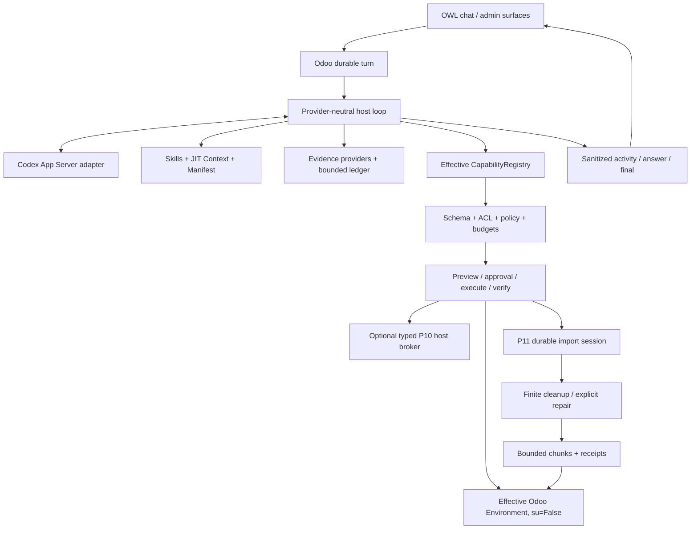

# Odoo AI Assistant

Odoo AI Assistant is an Odoo 18 Community addon with a durable provider-neutral agent
host embedded inside Odoo. It is designed as a modern Assistant that understands the
real installation, uses bounded evidence, operates under real Odoo permissions and
performs controlled effects through host-owned contracts.

## Current state

```text
P0-P10 COMPLETE / ACCEPTED
P11 ADVANCED IMPORTS CSV CORE IMPLEMENTED
P11 CLEANUP + REJECTED-WINDOW REPAIR IMPLEMENTED
P11 FOCUSED + REAL VALIDATION PENDING
P11 NOT ACCEPTED
```

P10 remains the latest accepted phase through `bde508b`. P11 code exists on `main` but
no P11 gate is represented as PASS. See
[`docs/research/EXECUTION_STATE.md`](docs/research/EXECUTION_STATE.md).

## Product direction

The Assistant should be able to understand user/company/screen/module context, inspect
models and schemas, query Odoo under real ACLs, use runtime/source/XML/log/document
Evidence, execute controlled actions with preview/policy/verification, perform large
data work through durable workflows, show safe progress and extend through installed
providers without adding a parallel tool registry.

Product-facing profiles are exactly `user` and `technical`. Autonomy never expands
permissions or Technical reach.

## Architecture



Odoo remains persistence and operational authority. Codex App Server is an ephemeral
provider subprocess. The optional P10 broker is a finite machine privilege boundary,
not the Assistant runtime.

`CapabilityDefinition` is the atomic executable contract. Skills, ContextProviders,
EvidenceProviders, file contents and model proposals cannot bypass capability
availability, Odoo ACLs, policy or verification. There is no arbitrary SQL, Python,
shell, sudo or unrestricted ORM-method surface.

## Evidence and Knowledge

P8 provides bounded provider-neutral Evidence with provenance, access/freshness checks,
installation runtime/source/XML/log providers and question-sensitive routing. P9 adds
Odoo-native company Knowledge with bounded document ingestion, PostgreSQL lexical FTS,
citations and stale-version revalidation. Retrieved/file text remains untrusted data.

## P10 Technical/host operations — accepted

Accepted Technical capabilities include:

```text
odoo.module.inspect
postgres.health
odoo.config.inspect
odoo.config.patch
host.service.status
host.service.restart
odoo.module.update
```

ADR-024 governs the optional AF_UNIX broker: deployment-owned logical targets,
`SO_PEERCRED`, bounded request/receipt schemas, fixed argv, durable replay ledger,
explicit uncertainty and a lifecycle-safe external module-update adapter. Generic
shell and unrestricted host authority are not provided.

## P11 advanced CSV imports — implemented, validation pending

P11 implements:

```text
odoo.ai.data.import.session
odoo.ai.data.import.chunk

assistant.data_import.inspect_csv
assistant.data_import.start_csv
assistant.data_import.status
assistant.data_import.inspect_cleanup
assistant.data_import.start_clean_csv
assistant.data_import.inspect_rejected
assistant.data_import.resume_csv
```

The import path is:

```text
current-turn CSV artifact
 -> Odoo base_import inspection/mapping suggestions
 -> host-filtered direct scalar mapping
 -> mapped rows staged once + fingerprinted
 -> preview / policy / approval
 -> durable bounded background chunks under originating user, su=False
 -> completed or rejected chunk receipts
 -> optional explicit rejected-window repair/resume
```

A chunk's business rows, cursor and completed receipt share one PostgreSQL transaction,
so a committed chunk is not blindly replayed. Native validation failures roll back the
current chunk before a rejected receipt is stored.

The model can propose deterministic cleanup only through the finite operations:

```text
trim
normalize_whitespace
replace_exact
set_if_empty
```

They apply only to fields already in the validated mapping. Cleanup preview exposes
bounded before/after evidence and duplicate counts. `corrected_rows` increases only
for changed rows that actually commit.

After a rejection, the owner can inspect only a bounded view of the rejected mapped
row window. `resume_csv` accepts explicit `row + mapped field + replacement value`
corrections, preserves earlier completed chunks and the historical rejected receipt,
increments a repair revision/fingerprint and retries from the unchanged committed
cursor with a new receipt sequence.

Current P11 scope is create-only CSV. XLS/XLSX/ODS sessions, relational paths,
external-id upsert/update, arbitrary transformation scripts and generic semantic
matching are not claimed.

See:

- [`docs/research/P11_ADVANCED_IMPORTS_FIRST_SLICE.md`](docs/research/P11_ADVANCED_IMPORTS_FIRST_SLICE.md)
- [`docs/research/P11_IMPORT_CLEANUP_REPAIR_SLICE.md`](docs/research/P11_IMPORT_CLEANUP_REPAIR_SLICE.md)
- [`docs/research/P11_FOCUSED_VALIDATION_RUNBOOK.md`](docs/research/P11_FOCUSED_VALIDATION_RUNBOOK.md)

## Installation

Add the repository `addons` directory to the Odoo 18 addons path and install
`odoo_ai_assistant`. The current addon version is `18.0.13.30.0` and uses Odoo's
standard `base_import` module for P11 CSV workflows. Configure the reasoning provider
through [`docs/DEPLOYMENT_CONFIG.md`](docs/DEPLOYMENT_CONFIG.md).

Deploy `host_broker/` only if finite Technical host operations are required. Do not
deploy the retired historical Assistant sidecar.

## Documentation

Start with:

1. [`docs/CURRENT_STATE.md`](docs/CURRENT_STATE.md)
2. [`docs/ARCHITECTURE.md`](docs/ARCHITECTURE.md)
3. [`docs/PRODUCT_VISION.md`](docs/PRODUCT_VISION.md)
4. [`docs/CAPABILITY_FRAMEWORK.md`](docs/CAPABILITY_FRAMEWORK.md)
5. [`docs/EVIDENCE_ARCHITECTURE.md`](docs/EVIDENCE_ARCHITECTURE.md)
6. [`docs/KNOWLEDGE_INDEX.md`](docs/KNOWLEDGE_INDEX.md)
7. [`docs/research/EXECUTION_STATE.md`](docs/research/EXECUTION_STATE.md)

P10 acceptance evidence is immutable. P11 currently has 8 prepared focused Odoo test
methods across two classes and six unexecuted HARD real gates. No P11 PASS/acceptance
claim should be made until those gates actually run.
