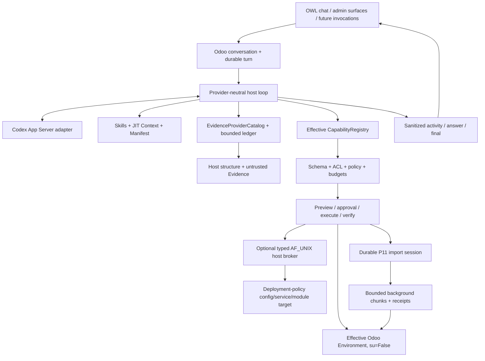

# Odoo AI Assistant

Odoo AI Assistant is an Odoo 18 Community addon with a durable provider-neutral agent
host embedded inside Odoo. The target is a modern ChatGPT/Claude-style Assistant that
understands the real installation, uses evidence, consults data under real permissions
and performs controlled actions through host-owned contracts.

## Current state

```text
P0-P10 COMPLETE / ACCEPTED
P11 DURABLE CSV FIRST SLICE IMPLEMENTED
P11 FOCUSED + REAL VALIDATION PENDING
P11 NOT ACCEPTED
```

P10 remains the latest accepted phase through `bde508b`. P11 now has executable
`DataImportSession` code but no P11 gate is PASS yet. The exact cursor is
[`docs/research/EXECUTION_STATE.md`](docs/research/EXECUTION_STATE.md).

## Product direction

The Assistant should be able to:

- understand the current user, company, screen, record and installed modules;
- discover effective models, fields, relations, capabilities and configuration;
- query Odoo under real ACLs, record rules and field access;
- ground installation-specific answers in runtime/source/XML/log/document Evidence;
- prepare and execute controlled effects with policy, approval when required and
  post-effect verification;
- perform large data work through durable workflows instead of thousands of tiny CRUD
  calls;
- show useful public progress without exposing private reasoning or secrets;
- extend through installed-addon providers without editing the core registry;
- perform finite Technical host operations only through a separately governed machine
  privilege boundary.

The customer experiences one Odoo AI Assistant product. The addon exposes an Odoo
application for Knowledge, Diagnostics and Configuration, while chat remains available
from the systray.

Product-facing profiles are exactly:

```text
user
technical
```

The P10 broker is a machine execution boundary, not another human profile.

## Architecture



Odoo remains persistence and operational authority. Codex App Server is an ephemeral
provider subprocess, not a product daemon. Provider credentials remain in private
`CODEX_HOME`, not PostgreSQL, prompts or logs.

## Capability, Context and Evidence framework

`CapabilityDefinition` is the atomic executable contract. It declares stable
name/version, schemas, risk/effect/exposure/approval, groups/guards/settings, budgets,
trusted handlers, preview/verification and safe public activity metadata.

Resources compose around it:

```text
CapabilityProvider
  -> CapabilityDefinition[]  executable only after host validation
  -> SkillDefinition[]       trusted installed-code guidance
  -> ContextProvider[]       bounded JIT untrusted context
  -> EvidenceProvider[]      bounded cited untrusted evidence
```

There is no parallel tool registry for chat, future automation or MCP. The framework
rejects arbitrary SQL, Python, shell, sudo and unrestricted Odoo method execution.

## Evidence and Knowledge

P8 provides provider-neutral Evidence contracts, logical locators, access/freshness
checks, fingerprints, secret-safe projections, question-sensitive routing and a
bounded turn ledger. Live providers cover sanitized runtime/module facts,
installed-addon source/XML and correlated configured logs.

P9 adds Odoo-native company Knowledge with source/chunk/temporary-attachment models,
company/private record rules, bounded PDF/TXT/Markdown/RST/CSV/JSON/XML ingestion,
PostgreSQL lexical FTS, citations and stale-version revalidation. Vector retrieval
remains conditional on measured quality gain.

Files attached to chat are short-lived current-turn artifacts unless explicitly
persisted. Binary/base64 content is not dumped into the model prompt.

## Writes and autonomy

The effect lifecycle is:

```text
discover -> inspect schema/preconditions -> prepare/preview -> policy
 -> approval when required -> durable barrier -> execute -> verify
 -> receipt/recovery
```

Autonomy never expands Odoo ACLs, Technical capability availability, field authority
or broker policy. Ambiguous effects are not retried automatically.

## P10 typed Technical/host operations — accepted

Accepted P10 capabilities include:

```text
odoo.module.inspect
postgres.health
odoo.config.inspect
odoo.config.patch
host.service.status
host.service.restart
odoo.module.update
```

ADR-024 governs the optional Linux broker: finite logical targets, bidirectional
`SO_PEERCRED`, bounded canonical requests/receipts, exact EffectPlan binding, fixed
argv, durable replay ledger and explicit uncertain-state handling. Module updates use
a separate non-root maintenance unit and fresh-registry verification.

Not implemented by P10: module install/uninstall, repository/package promotion,
generic shell fallback or secret reveal.

## P11 durable CSV imports — implemented, validation pending

The first P11 slice adds:

```text
odoo.ai.data.import.session
odoo.ai.data.import.chunk
assistant.data_import.inspect_csv
assistant.data_import.start_csv
assistant.data_import.status
```

It reuses the current-turn attachment boundary and Odoo 18 `base_import` parsing and
mapping behavior. The host restricts the final map to the originating user's eligible
model and direct writable scalar fields, fingerprints the artifact/model/mapping, and
starts a policy-controlled durable session.

Background chunks execute as the originating user with `su=False`. A chunk's business
rows, cursor advance and durable receipt share one PostgreSQL transaction boundary, so
a pre-commit interruption rolls them back together while a committed chunk is not
blindly replayed. Exact imported/rejected/remaining counts and bounded per-chunk record
ids/receipts are available through status.

The first slice is deliberately create-only CSV. Relational paths, XLS/XLSX/ODS
sessions, external-id upsert/update, row-level salvage, model-assisted row enrichment,
interactive remap/resume and automatic final background synthesis remain P11 work.
`corrected_rows` therefore remains zero for this slice.

See:

- [`docs/research/P11_ADVANCED_IMPORTS_FIRST_SLICE.md`](docs/research/P11_ADVANCED_IMPORTS_FIRST_SLICE.md)
- [`docs/research/P11_FOCUSED_VALIDATION_RUNBOOK.md`](docs/research/P11_FOCUSED_VALIDATION_RUNBOOK.md)

## Supported runtime boundary

The supported application is `addons/odoo_ai_assistant` plus the embedded runtime and,
when explicitly deployed, the finite P10 host adapter. Historical `service/`,
`installer/`, root migration and old task/evidence material may remain for lineage but
are not current runtime sources.

Source relevance defaults are documented in
[`docs/CONTEXT_SOURCE_POLICY.md`](docs/CONTEXT_SOURCE_POLICY.md).

## Installation and deployment

Add the repository's `addons` directory to the Odoo 18 addons path and install
`odoo_ai_assistant` through normal Odoo module management. Current addon dependencies
include Odoo's standard `base_import` module for the P11 CSV workflow. Configure Codex
and its private `CODEX_HOME` according to
[`docs/DEPLOYMENT_CONFIG.md`](docs/DEPLOYMENT_CONFIG.md).

Do not deploy the historical sidecar. Deploy `host_broker/` only when finite Technical
host operations are required.

## Documentation

Start with:

1. [`docs/CURRENT_STATE.md`](docs/CURRENT_STATE.md)
2. [`docs/ARCHITECTURE.md`](docs/ARCHITECTURE.md)
3. [`docs/PRODUCT_VISION.md`](docs/PRODUCT_VISION.md)
4. [`docs/CAPABILITY_FRAMEWORK.md`](docs/CAPABILITY_FRAMEWORK.md)
5. [`docs/EVIDENCE_ARCHITECTURE.md`](docs/EVIDENCE_ARCHITECTURE.md)
6. [`docs/KNOWLEDGE_INDEX.md`](docs/KNOWLEDGE_INDEX.md)
7. [`docs/research/P11_ADVANCED_IMPORTS_FIRST_SLICE.md`](docs/research/P11_ADVANCED_IMPORTS_FIRST_SLICE.md)
8. [`docs/research/EXECUTION_STATE.md`](docs/research/EXECUTION_STATE.md)

The documentation index is [`docs/README.md`](docs/README.md).

## Validation status

P10 focused and real gates are PASS in
[`P10-ACCEPTANCE-bde508b.md`](docs/research/evidence/phase10/2026-09-03/P10-ACCEPTANCE-bde508b.md).

P11 focused tests are prepared but not executed; all six P11 real gates remain open.
Broad regressions remain periodic debt unless explicitly required or a focused failure
shows a wider blast radius.

## Development rules

Read [`AGENTS.md`](AGENTS.md) before changing architecture. Extend the current
capability/turn/evidence framework rather than adding a parallel agent, registry,
database, scheduler or general sidecar. Run the smallest focused validation that
proves the changed contract and record unexecuted real gates honestly.
