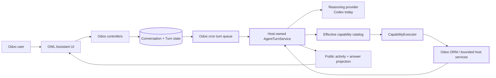
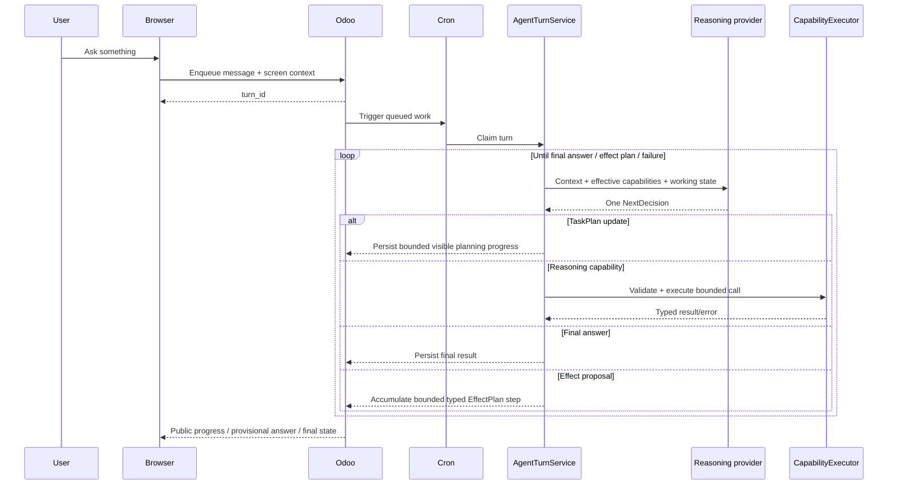
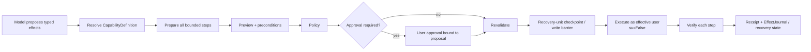
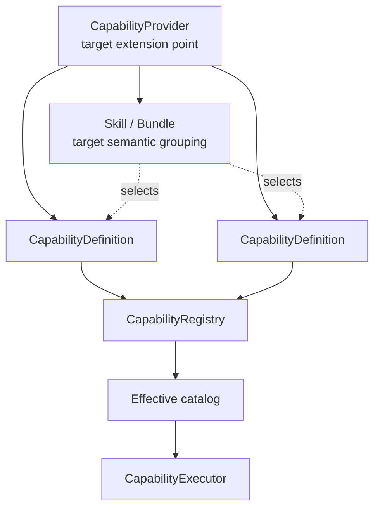

# Odoo AI Assistant

**A host-authorized AI agent embedded in Odoo 18 Community.**

The goal is not to bolt a chatbot onto Odoo. The goal is to make an assistant that can understand the real installation, inspect and query Odoo safely, propose controlled changes, explain what it is doing, and grow through reusable capabilities without turning the model into the security boundary.

> **Current state (2026-08-30):** Phase 5 is fully accepted. Phase 6 is implemented as a candidate across P6.1-P6.6: provider-neutral TaskPlan planning modes/replans, bounded multi-step EffectPlan, recovery units, separate budget families and a short-lived EffectJournal. Phase 6 is **not accepted yet**; one consolidated periodic full regression plus the accumulated real-product gates remains the blocker before Phase 7. See [`docs/CURRENT_STATE.md`](docs/CURRENT_STATE.md) and [`docs/research/EXECUTION_STATE.md`](docs/research/EXECUTION_STATE.md).

## What this project is

Odoo remains the application, database, identity provider, permission system, scheduler and execution authority. Codex is currently the reasoning provider and runs as an **ephemeral App Server subprocess** for product turns.

The important boundary is simple:

- **The model reasons and proposes.**
- **The host decides what is actually available and valid.**
- **Odoo permissions decide what the user may see or change.**
- **Effects are previewed, authorized, executed and verified by deterministic code.**

This is intentionally different from giving an LLM unrestricted ORM, SQL, Python or shell access.

## A turn, in plain language

A user message becomes a durable Odoo turn instead of a long blocking HTTP request.

A provider decision is **not** an instruction to blindly execute. The host resolves the requested capability again, validates arguments and applies the appropriate authority path.

## Safe writes

Business changes follow a stronger lifecycle than normal read-only reasoning:

A write that becomes ambiguous after an execution checkpoint is **not automatically retried**. The runtime records effect certainty and recovery state instead of guessing.

## The capability model

`CapabilityDefinition` is the atomic executable contract. A definition describes one operation: schemas, risk/effect metadata, availability constraints, budgets and the trusted handler.

Current core providers include:

| Provider | Purpose |
|---|---|
| `odoo_query` | schema-first bounded Odoo reads and aggregates |
| `odoo_actions` | explicit supported business effects |
| `odoo_batch` | bounded collection/batch effects through the same authority path |
| `odoo_runtime` | narrow runtime facts; not a shell/filesystem back door |
| `odoo_navigation` | bounded contextual Odoo navigation references |
| `odoo_compensations` / `odoo_unarchive` | HOST-only safe compensation support for eligible verified effects |

The long-term composition model is deliberately layered **above** the atomic definition:

`Skill/Bundle`, external `CapabilityProvider`, `ContextProvider`, `EvidenceProvider` and progressive disclosure are **target architecture**, not current product claims. See [`docs/CAPABILITY_FRAMEWORK.md`](docs/CAPABILITY_FRAMEWORK.md).

## Current vs target

| Area | Current | Direction |
|---|---|---|
| Deployment | Embedded Odoo addon + ephemeral Codex | Keep Odoo as operational authority |
| Agent loop | Host-owned iterative `NextDecision` loop with TaskPlan strategy | Richer context/evidence and capability breadth without a rigid intent router |
| Effects | Bounded typed EffectPlan up to 5 steps, host-derived recovery units, verification and short-lived EffectJournal | Validate the candidate and extend typed effect families/external recovery only behind explicit contracts |
| Frontend | Durable multi-chat, activity/answer/reasoning projection, planning selector, live TaskPlan, approval/recovery/navigation UX | Continue product polish and future evidence/knowledge surfaces |
| Capabilities | Core auto-discovered definitions inside this addon | Trusted addon providers + Skills/Bundles + progressive disclosure |
| Context | Screen/conversation/runtime Odoo context with immutable turn settings | Extensible per-model/context providers |
| Evidence/RAG | No general active RAG layer | Source/runtime/log/document/web evidence routed by type |
| Knowledge | Not a complete product subsystem yet | Company knowledge + hybrid retrieval + provenance |
| MCP/automations/AI fields | Not product surfaces yet | Thin consumers of the same capability/policy host |
| Providers | Codex product provider | Add another only when a real case justifies it |

This distinction matters: roadmap documents describe intended product behavior; [`docs/CURRENT_STATE.md`](docs/CURRENT_STATE.md) describes what is actually available now.

## Repository map

The local READMEs are meant to make each boundary understandable without reading the whole codebase.

| Path | What lives there |
|---|---|
| [`addons/odoo_ai_assistant/`](addons/odoo_ai_assistant/) | installable Odoo addon and end-to-end component map |
| [`addons/odoo_ai_assistant/controllers/`](addons/odoo_ai_assistant/controllers/) | short browser/internal HTTP boundaries |
| [`addons/odoo_ai_assistant/models/`](addons/odoo_ai_assistant/models/) | durable Odoo state, queue, policy and lifecycle coordination |
| [`addons/odoo_ai_assistant/services/`](addons/odoo_ai_assistant/services/) | small application services for context/account/inventory |
| [`addons/odoo_ai_assistant/runtime/`](addons/odoo_ai_assistant/runtime/) | reasoning runtime, Codex lifecycle and capability host |
| [`addons/odoo_ai_assistant/runtime/agent/`](addons/odoo_ai_assistant/runtime/agent/) | provider-neutral host-owned agent loop |
| [`addons/odoo_ai_assistant/runtime/capabilities/`](addons/odoo_ai_assistant/runtime/capabilities/) | capability contracts, registry, policy and executor |
| [`addons/odoo_ai_assistant/runtime/capabilities/providers/`](addons/odoo_ai_assistant/runtime/capabilities/providers/) | current core Odoo capabilities |
| [`addons/odoo_ai_assistant/static/src/`](addons/odoo_ai_assistant/static/src/) | OWL/web-client product UI |
| [`addons/odoo_ai_assistant/security/`](addons/odoo_ai_assistant/security/) | Odoo ACL/record-rule definitions and a residual bounded compatibility boundary |
| [`addons/odoo_ai_assistant/tests/`](addons/odoo_ai_assistant/tests/) | Odoo/Python contract and runtime tests |
| [`addons/odoo_ai_assistant/static/tests/`](addons/odoo_ai_assistant/static/tests/) | frontend HOOT tests |
| [`docs/`](docs/) | current architecture, product vision, ADRs, roadmap and validation evidence |
| [`service/`](service/) | **retired** standalone Assistant Service lineage |
| [`installer/`](installer/) | **retired** sidecar installer lineage |

## Install and try it

The supported baseline is Odoo 18 Community.

1. Add this repository's `addons` directory to Odoo's `addons_path`.
2. Update Apps and install **Odoo AI Assistant**.
3. Ensure Odoo cron processing is enabled; long turns depend on native cron workers/threads.
4. Open Odoo Settings and connect the Codex runtime account.
5. Configure the assistant model, reasoning effort, planning mode and autonomy policy as appropriate.
6. Open the Assistant from the web client and submit a turn.

The Codex executable is a host-level dependency. The addon discovers it from `PATH` or the configured override; it does not download or bundle the binary by default.

For operational details use [`docs/DEPLOYMENT_CONFIG.md`](docs/DEPLOYMENT_CONFIG.md) and [`docs/codex/`](docs/codex/).

## How to extend the project without fighting the architecture

Use the smallest existing boundary that owns the problem:

- **New bounded Odoo read/action:** add a `CapabilityDefinition`; do not add a parallel tool registry.
- **New vertical domain pack:** keep semantic business operations as capabilities and, when the layer exists, group them with a Skill/Bundle.
- **New reasoning provider:** implement the provider seam; do not duplicate Odoo authority or effect execution.
- **New UI surface:** call the same Odoo turn/capability runtime; do not create a second agent backend.
- **New retrieval source:** target the Evidence/Context contracts and keep retrieved content non-authoritative.
- **New high-risk host operation:** define a separate technical authority profile, explicit schemas, policy, verification and recovery. Do not expose a generic shell for convenience.
- **Architecture-changing deployment or authority decision:** write/update an ADR first.

If a piece is replaced, preserve the contract on both sides. For example, a different frontend may replace OWL presentation, but it should still treat Odoo turns/events as authoritative. A different model provider may replace Codex, but it must still return untrusted decisions to the host-owned loop.

## Documentation: where to start

- **New to the project:** [`docs/README.md`](docs/README.md)
- **What exists today:** [`docs/CURRENT_STATE.md`](docs/CURRENT_STATE.md)
- **What the product is trying to become:** [`docs/PRODUCT_VISION.md`](docs/PRODUCT_VISION.md)
- **Architecture and boundaries:** [`docs/ARCHITECTURE.md`](docs/ARCHITECTURE.md)
- **Capability model:** [`docs/CAPABILITY_FRAMEWORK.md`](docs/CAPABILITY_FRAMEWORK.md)
- **Current agent runtime:** [`docs/UNIFIED_AGENT_RUNTIME.md`](docs/UNIFIED_AGENT_RUNTIME.md)
- **Accepted architecture decisions:** [`docs/adr/`](docs/adr/)
- **Roadmap execution state:** [`docs/research/EXECUTION_STATE.md`](docs/research/EXECUTION_STATE.md)
- **Real-environment validation protocol:** [`docs/research/REAL_ENV_VALIDATION_PROTOCOL.md`](docs/research/REAL_ENV_VALIDATION_PROTOCOL.md)

### Source-of-truth rule

When documents disagree, use this order:

1. current code + accepted ADRs;
2. current-state/current architecture docs;
3. deterministic and real-environment tests/evidence;
4. research/roadmap documents;
5. dated reports, external references and historical code.

The `service/` and `installer/` trees are intentionally historical. A small machine-authenticated inventory callback still exists in the current addon as residual compatibility plumbing; it is **not** the normal product runtime and should not be used as the template for new features.

## Design principles in one screen

- Odoo is the authority.
- Business capabilities run as the effective user with `su=False`.
- The model may propose; the host validates.
- Reads can be broad but bounded. Effects are explicit and verifiable.
- Persistence belongs in Odoo.
- Long work is durable, cancelable and recoverable.
- Public progress is sanitized product state, not private chain-of-thought.
- Retrieved text is evidence/data, never policy.
- Extend the capability host before inventing another tools/plugins/actions system.
- Prefer a small embedded solution over another operational service or framework unless a measured need proves otherwise.
