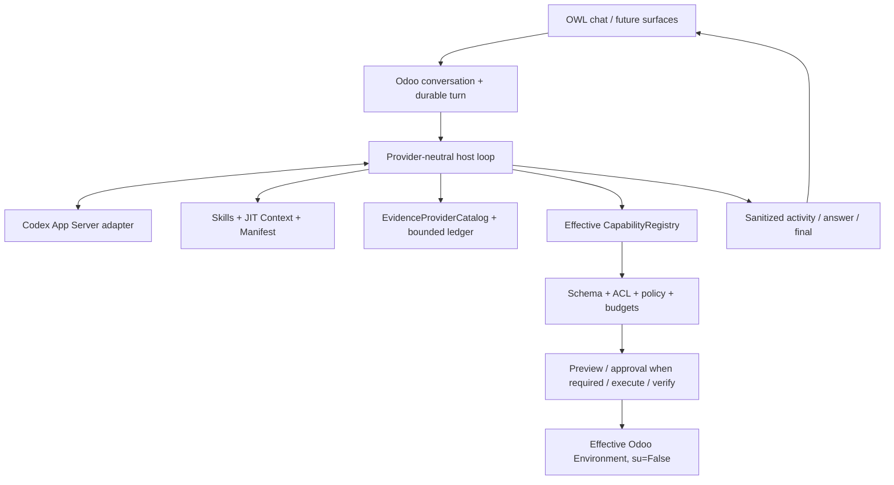

# Odoo AI Assistant

Odoo AI Assistant is an Odoo 18 Community addon that embeds a durable, provider-
neutral agent host inside Odoo. It is intended to behave more like a modern
ChatGPT/Claude-style agent integrated with the real installation than a rigid
intent chatbot.

## Current state

```text
P0-P7 COMPLETE / ACCEPTED
P8.0 architecture hardening IMPLEMENTED
P8.1/P8.2 Evidence foundation IMPLEMENTED
focused P8 validation PENDING
P8 real gates NOT EXECUTED / NOT ACCEPTED
```

The exact cursor is
[`docs/research/EXECUTION_STATE.md`](docs/research/EXECUTION_STATE.md). Code or a
prepared test never counts as PASS evidence by itself.

## Product direction

The Assistant should be able to:

- understand the current user, company, screen, record and installed modules;
- discover effective models, fields, relations, capabilities and configuration;
- query Odoo under real ACLs, record rules and field access;
- ground installation-specific answers in runtime/source/XML/log/document Evidence;
- prepare and execute controlled effects with policy, approval when required and
  post-write verification;
- show useful public progress without exposing private reasoning or secrets;
- extend through installed-addon providers without editing the core registry.

The customer experiences one Odoo AI Assistant product. Internal domain/link addons
may be added later and auto-installed when appropriate; they must not create manual
packaging friction.

Product-facing profiles are limited to:

```text
User / non-technical
Technical
```

Internal compatibility names do not create extra human roles. Any future host
privilege broker is a technical boundary, not a Developer/Operator/Admin-AI group.

## Architecture



Odoo is persistence and operational authority. Codex App Server is an ephemeral
provider subprocess, not a product daemon. Credentials remain provider-owned in the
host-configured `CODEX_HOME`; they are not copied into PostgreSQL, prompts or logs.

## Capability and Evidence framework

`CapabilityDefinition` is the atomic executable contract. It declares a bounded
schema, handler, risk/effect semantics, guards and budgets. The model proposes a
call; the host validates and executes it.

P7/P8 compose resources around that unit:

```text
CapabilityProvider
  -> CapabilityDefinition[]  executable authority after host validation
  -> SkillDefinition[]       trusted installed-code guidance
  -> ContextProvider[]       bounded JIT untrusted context
  -> EvidenceProvider[]      bounded cited untrusted evidence
```

The framework explicitly rejects arbitrary SQL, Python, shell, sudo and unrestricted
Odoo method execution.

### P8 Evidence foundation

The repository now contains provider-neutral Evidence contracts, access/freshness
checks, logical locators, canonical fingerprints, optional-provider isolation,
question-sensitive routing, secret-safe projections and a bounded turn ledger.
The first provider exposes sanitized installation/module/registry facts from Odoo.

Evidence is data. It cannot enable tools, waive approval, change profile or grant
permissions. Mutable business facts continue to use live ORM. See
[`docs/EVIDENCE_ARCHITECTURE.md`](docs/EVIDENCE_ARCHITECTURE.md).

## Writes and autonomy

The effect lifecycle is:

```text
discover -> inspect schema -> prepare -> preview -> policy
 -> approval only when required -> execute -> verify -> receipt/recovery
```

Approval is policy/autonomy-driven rather than a confirmation on every write. In
full-control, a permitted auto-executable operation may proceed without redundant
confirmation when the user already gave explicit intent. The Assistant still has
no more authority than the effective Odoo user, and ambiguous writes are not
retried automatically.

## Supported runtime boundary

The supported application is `addons/odoo_ai_assistant` plus the embedded runtime.
Historical `service/`, `installer/`, root migration and old task/evidence material
may remain for lineage but are not current runtime sources by default.

The obsolete GitHub Actions workflow that validated retired sidecar components and
the `auth="none"` machine-secret inventory callback have been removed. Supported
Assistant controllers authenticate through Odoo. Installation inventory is consumed
in process through Evidence.

Source relevance defaults are documented in
[`docs/CONTEXT_SOURCE_POLICY.md`](docs/CONTEXT_SOURCE_POLICY.md).

## Installation and deployment

Add the repository's `addons` directory to the Odoo 18 addons path and install the
`odoo_ai_assistant` addon using normal Odoo module management. Configure the Codex
provider and its private `CODEX_HOME` according to
[`docs/DEPLOYMENT_CONFIG.md`](docs/DEPLOYMENT_CONFIG.md) and
[`docs/codex/README.md`](docs/codex/README.md).

Do not deploy the historical sidecar as part of the supported product. Long-running
turns are persisted in Odoo and claimed by configured `ir.cron` workers.

## Documentation

Start with:

1. [`docs/CURRENT_STATE.md`](docs/CURRENT_STATE.md)
2. [`docs/ARCHITECTURE.md`](docs/ARCHITECTURE.md)
3. [`docs/PRODUCT_VISION.md`](docs/PRODUCT_VISION.md)
4. [`docs/CAPABILITY_FRAMEWORK.md`](docs/CAPABILITY_FRAMEWORK.md)
5. [`docs/EVIDENCE_ARCHITECTURE.md`](docs/EVIDENCE_ARCHITECTURE.md)
6. [`docs/OBSERVABILITY_ARCHITECTURE.md`](docs/OBSERVABILITY_ARCHITECTURE.md)
7. [`docs/research/EXECUTION_STATE.md`](docs/research/EXECUTION_STATE.md)

The documentation index explains current, target and historical status:
[`docs/README.md`](docs/README.md).

## Tests prepared for this checkpoint

```text
tests/unit/test_phase8_evidence_contracts.py
tests/unit/test_phase8_supported_surface.py
tests/addon/test_phase8_runtime_evidence.py
```

They cover bounded contracts, deep immutability, secret redaction, provider failure
isolation, access recheck, ledger restore/overflow, routing, supported HTTP surface
and live Odoo inventory/freshness. They must be executed in the appropriate local/
Codex Odoo environment before P8 acceptance; GitHub repository writes do not execute
them.

## Development rules

Read [`AGENTS.md`](AGENTS.md) before changing architecture. Extend the current
capability/turn framework rather than adding a parallel agent, registry, database,
scheduler or general sidecar. Run the smallest focused validation that proves the
changed contract, and record unexecuted real gates honestly.
