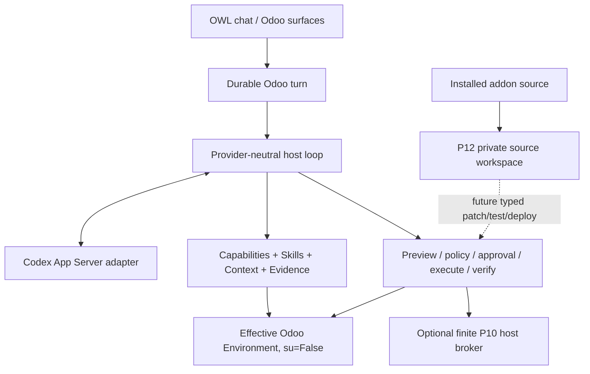

# Odoo AI Assistant

Odoo AI Assistant is an Odoo 18 Community addon with a durable provider-neutral agent
host embedded in Odoo. Odoo remains identity, persistence, permission, policy and
execution authority; the reasoning model proposes work through typed host contracts.

## Current state

```text
P0-P11 COMPLETE / ACCEPTED
P11 accepted through 72b4b826bddffc20f99f5cd72f14ed95111eab5c
P12.1 BOUNDED SOURCE WORKSPACES IMPLEMENTED / FOCUSED VALIDATION PENDING
P12 NOT ACCEPTED
```

The exact cursor is [`docs/research/EXECUTION_STATE.md`](docs/research/EXECUTION_STATE.md).

## Product architecture



`CapabilityDefinition` is the atomic executable contract. Skills, Evidence, files and
model text never grant permissions. There is no arbitrary SQL, Python, shell, sudo or
unrestricted Odoo method surface.

Public product profiles are exactly `user` and `technical`; autonomy is independent
from technical reach.

## Accepted product capabilities

The accepted runtime supports durable multi-turn agent work, non-blocking concurrent
conversations, bounded reads/queries/actions, multi-step effects, verification and
recovery, provider-neutral extensions, installation/source/log Evidence, Odoo-native
company Knowledge, typed Technical host operations and durable advanced CSV imports.

P10 host operations use an optional AF_UNIX broker with deployment-owned logical
targets and durable receipts rather than a root shell. P11 large imports use durable
Odoo sessions/chunks under the originating effective user rather than thousands of
small CRUD calls. P11 focused and all six real import gates are accepted at
`docs/research/evidence/phase11/2026-09-03/P11-ACCEPTANCE-72b4b82.md`.

## P12.1 controlled source modification foundation

ADR-025 establishes **workspace-first** source modification. Current P12.1 code can
snapshot one installed addon into a private bounded workspace under the Odoo Assistant
runtime area. Host code resolves the module source root; the model never chooses a
physical path.

The foundation includes host-generated workspace ids, deterministic source/workspace
fingerprints, user/company/database/turn binding, symlink/path-escape denial, private
permissions and file/byte ceilings. Public metadata contains logical identities and
fingerprints, not physical paths or raw database names.

P12.1 intentionally exposes no patch, arbitrary file write, test command or production
deploy capability. Future P12 work is ordered:

```text
P12.2 typed proposed diff/patch against the bound workspace
P12.3 tests bound to the exact post-patch workspace fingerprint
P12.4 separately authorized deploy + verify + recovery
```

Protected production deployment must remain a finite host operation behind ADR-024 or
an equivalent narrow adapter. Generic shell/Git/sudo is not the implementation plan.

## Validation

P11 is fully accepted on immutable evidence. For P12.1, 10 dependency-light workspace
tests and Python compilation passed during preparation, while the focused Odoo
`TestPhase12SourceWorkspace` gate is prepared but not executed. P12.2 remains blocked
until the focused P12.1 authority gate is green.

See:

- [`docs/adr/ADR-025-controlled-source-workspaces.md`](docs/adr/ADR-025-controlled-source-workspaces.md)
- [`docs/research/P12_SOURCE_WORKSPACE_FOUNDATION.md`](docs/research/P12_SOURCE_WORKSPACE_FOUNDATION.md)
- [`docs/research/P12_FOCUSED_VALIDATION_RUNBOOK.md`](docs/research/P12_FOCUSED_VALIDATION_RUNBOOK.md)

## Installation

Add the repository `addons` directory to the Odoo 18 addons path and install
`odoo_ai_assistant` normally. Codex/provider credentials stay in host-owned
`CODEX_HOME`, not PostgreSQL, prompts or source workspaces. Deploy `host_broker/` only
when the finite Technical host operations are required.

Read [`AGENTS.md`](AGENTS.md) before architecture changes. The documentation entry point
is [`docs/README.md`](docs/README.md).
