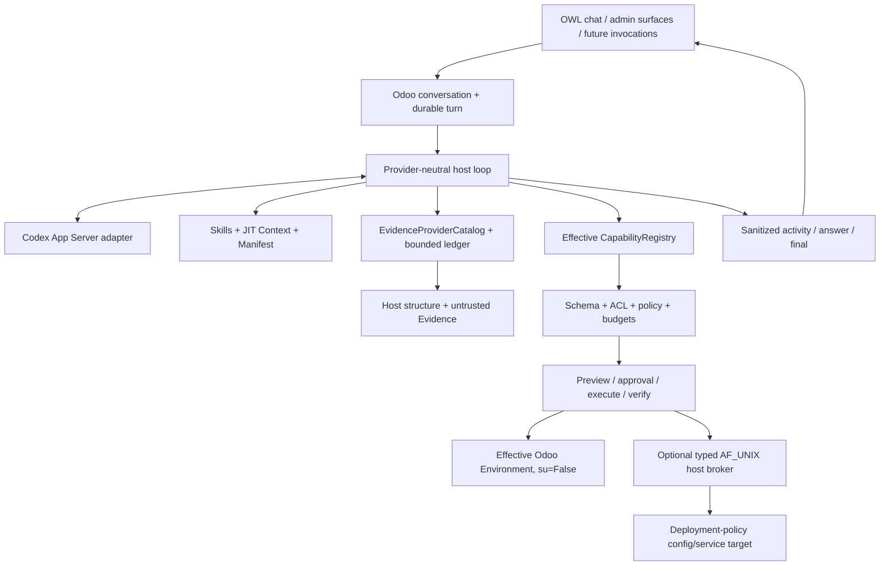

# Odoo AI Assistant

Odoo AI Assistant is an Odoo 18 Community addon with a durable provider-neutral agent
host embedded inside Odoo. The target is a modern ChatGPT/Claude-style Assistant that
understands the real installation, uses evidence, consults data under real permissions
and performs controlled actions through host-owned contracts.

## Current state

```text
P0-P9 COMPLETE / ACCEPTED
P10 PRIVILEGE-BOUNDARY ADR ACCEPTED
P10 TYPED HOST-OPERATIONS FIRST SLICE IMPLEMENTED
P10 FOCUSED + REAL VALIDATION PENDING
P10 MODULE-UPDATE ADAPTER MISSING
P10 NOT ACCEPTED
```

P9 remains the latest accepted phase. The exact cursor is
[`docs/research/EXECUTION_STATE.md`](docs/research/EXECUTION_STATE.md). Code or a
prepared test never counts as PASS evidence by itself.

## Product direction

The Assistant should be able to:

- understand the current user, company, screen, record and installed modules;
- discover effective models, fields, relations, capabilities and configuration;
- query Odoo under real ACLs, record rules and field access;
- ground installation-specific answers in runtime/source/XML/log/document Evidence;
- prepare and execute controlled effects with policy, approval when required and
  post-effect verification;
- show useful public progress without exposing private reasoning or secrets;
- extend through installed-addon providers without editing the core registry;
- perform finite Technical host operations only through a separately governed machine
  privilege boundary.

The customer experiences one Odoo AI Assistant product. The addon exposes a standalone
Odoo application for Knowledge, Diagnostics and Configuration, while chat remains
available from the systray.

Product-facing profiles are exactly:

```text
user
technical
```

Internal compatibility names do not create extra human roles. The P10 broker is a
machine execution boundary, not a Developer/Operator/Admin-AI persona.

## Architecture



Odoo remains persistence and operational authority. Codex App Server is an ephemeral
provider subprocess, not a product daemon. Provider credentials remain in private
`CODEX_HOME`, not PostgreSQL, prompts or logs.

The optional host broker runs no model and owns no conversation/turn state. It accepts
only finite versioned operations with logical targets, peer credentials, bounded
requests, durable receipts and recovery semantics.

## Capability, Context and Evidence framework

`CapabilityDefinition` is the atomic executable contract. It declares:

```text
stable name/version
input/output JSON Schema
risk/effect/exposure/approval
groups, guards, dependencies and settings
record/byte/time/call budgets
trusted handler
optional preview and verification
safe public activity metadata
```

Resources compose around it:

```text
CapabilityProvider
  -> CapabilityDefinition[]  executable only after host validation
  -> SkillDefinition[]       trusted installed-code guidance
  -> ContextProvider[]       bounded JIT untrusted context
  -> EvidenceProvider[]      bounded cited untrusted evidence
```

No parallel tool registry exists for chat, future automation or MCP. The framework
rejects arbitrary SQL, Python, shell, sudo and unrestricted Odoo method execution.

## Evidence and Knowledge

P8 provides provider-neutral Evidence contracts, logical locators, access/freshness
checks, fingerprints, secret-safe projections, question-sensitive routing and a
bounded turn ledger. Live providers cover sanitized runtime/module facts,
installed-addon source/XML and correlated configured logs.

P9 adds Odoo-native company Knowledge with source/chunk/temporary-attachment models,
company/private record rules, deterministic TXT/Markdown/RST/CSV/JSON/XML ingestion,
PostgreSQL lexical FTS, citations and stale-version revalidation. Vector retrieval
remains conditional on measured quality gain.

Evidence and Knowledge are data. They cannot reveal hidden capabilities, waive
approval or grant permissions. Mutable business facts continue to come from live ORM.

## Writes and autonomy

The effect lifecycle is:

```text
discover -> inspect schema/preconditions -> prepare/preview -> policy
 -> approval when required -> durable barrier -> execute -> verify
 -> receipt/recovery
```

Full-control can suppress a redundant confirmation only when trusted policy allows an
operation the effective user is already permitted to perform. Autonomy never expands
Odoo ACLs, Technical capability availability or broker policy. Ambiguous effects are
not retried automatically.

## P10 typed Technical/host operations

ADR-024 is accepted. The implemented first slice provides:

```text
odoo.module.inspect       Odoo-local Technical read
postgres.health           fixed read-only PostgreSQL diagnostic
odoo.config.inspect       broker-backed managed config read
odoo.config.patch         preview + policy + atomic patch + backup + verify
host.service.status       broker-backed exact service status
host.service.restart      preview + policy + fixed-argv restart + verify
```

The optional stdlib-only Linux broker uses:

- AF_UNIX and bidirectional `SO_PEERCRED`;
- deployment-owned logical target policy;
- bounded canonical request/receipt protocol;
- exact EffectPlan step/args/precondition binding;
- fixed-argv systemd operations with `shell=False`;
- atomic config replacement and private backup;
- durable SQLite replay ledger;
- terminal receipt replay and replay-mismatch denial;
- `host_effect_uncertain` after in-flight or post-dispatch transport/receipt loss.

User/non-technical accounts cannot discover these Technical capabilities even in full
autonomy.

Not implemented yet:

```text
odoo.module.install/update/uninstall
repository/package promotion
generic command fallback
secret reveal
```

Odoo 18 immediate module maintenance is deliberately not called from the Assistant
cron worker. A lifecycle-safe maintenance adapter is required before
`P10-REAL-MODULE-UPDATE` can run.

See:

- [`docs/adr/ADR-024-technical-host-privilege-broker.md`](docs/adr/ADR-024-technical-host-privilege-broker.md)
- [`docs/research/P10_HOST_OPERATIONS_FIRST_SLICE.md`](docs/research/P10_HOST_OPERATIONS_FIRST_SLICE.md)
- [`docs/research/P10_FOCUSED_VALIDATION_RUNBOOK.md`](docs/research/P10_FOCUSED_VALIDATION_RUNBOOK.md)
- [`host_broker/README.md`](host_broker/README.md)

## Supported runtime boundary

The supported application is `addons/odoo_ai_assistant` plus the embedded runtime and,
when explicitly deployed, the finite P10 host adapter. Historical `service/`,
`installer/`, root migration and old task/evidence material may remain for lineage
but are not current runtime sources.

The obsolete GitHub Actions workflow, unauthenticated sidecar inventory callback,
addon-local machine-auth primitive and residual inventory service are removed.
Supported controllers authenticate through Odoo.

Source relevance defaults are documented in
[`docs/CONTEXT_SOURCE_POLICY.md`](docs/CONTEXT_SOURCE_POLICY.md).

## Installation and deployment

Add the repository's `addons` directory to the Odoo 18 addons path and install
`odoo_ai_assistant` through normal Odoo module management. Configure Codex and its
private `CODEX_HOME` according to
[`docs/DEPLOYMENT_CONFIG.md`](docs/DEPLOYMENT_CONFIG.md).

Do not deploy the historical sidecar. Deploy `host_broker/` only when finite Technical
host operations are required, using an administrator-owned policy and exact
filesystem/service targets.

## Documentation

Start with:

1. [`docs/CURRENT_STATE.md`](docs/CURRENT_STATE.md)
2. [`docs/ARCHITECTURE.md`](docs/ARCHITECTURE.md)
3. [`docs/PRODUCT_VISION.md`](docs/PRODUCT_VISION.md)
4. [`docs/CAPABILITY_FRAMEWORK.md`](docs/CAPABILITY_FRAMEWORK.md)
5. [`docs/EVIDENCE_ARCHITECTURE.md`](docs/EVIDENCE_ARCHITECTURE.md)
6. [`docs/KNOWLEDGE_INDEX.md`](docs/KNOWLEDGE_INDEX.md)
7. [`docs/research/EXECUTION_STATE.md`](docs/research/EXECUTION_STATE.md)

The documentation index is [`docs/README.md`](docs/README.md).

## P10 validation status

Prepared P10 test surfaces:

```text
tests/unit/test_phase10_host_broker.py
tests/unit/test_phase10_host_broker_client.py
addons/odoo_ai_assistant/tests/test_phase10_host_operations.py
```

Focused static, dependency-light, Odoo and real P10 gates have not yet been recorded
as PASS. `P10-REAL-MODULE-UPDATE` is additionally blocked by the missing maintenance
adapter. Broad regressions remain periodic debt unless explicitly required or a
focused failure shows a wider blast radius.

## Development rules

Read [`AGENTS.md`](AGENTS.md) before changing architecture. Extend the current
capability/turn/evidence framework rather than adding a parallel agent, registry,
database, scheduler or general sidecar. Run the smallest focused validation that
proves the changed contract and record unexecuted real gates honestly.
