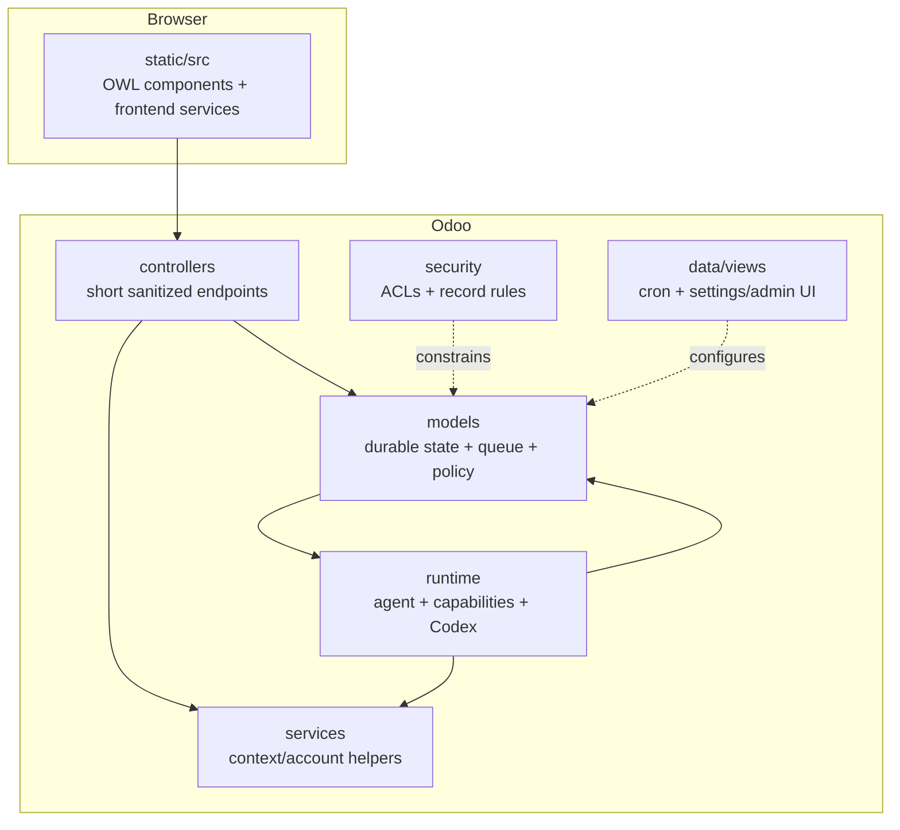

# Odoo AI Assistant addon

This directory is the **supported product runtime**. It is an installable Odoo 18 Community addon; there is no separate Assistant application in the normal architecture.

The manifest is the authoritative source for the current addon version, dependencies, data files and assets.

## What the addon owns

- the browser-facing Assistant product;
- conversations, turns, events, approvals/effect state, EffectJournal and preferences in Odoo models;
- durable background execution through Odoo cron;
- the host-owned agent loop and planning strategy;
- the capability registry/executor;
- Codex process/account lifecycle;
- Settings/Diagnostics integration;
- Odoo ACLs and record rules for Assistant-owned data.

It does **not** give the model direct database or server authority.

## End-to-end component map

## Directory guide

| Directory | Responsibility | Read this |
|---|---|---|
| `controllers/` | short HTTP/JSON boundaries; enqueue/status/history/live/account actions | [`controllers/README.md`](controllers/README.md) |
| `models/` | Odoo persistence and lifecycle coordination | [`models/README.md`](models/README.md) |
| `services/` | focused application services not deserving their own model/runtime subsystem | [`services/README.md`](services/README.md) |
| `runtime/` | provider lifecycle, agent loop and capability host | [`runtime/README.md`](runtime/README.md) |
| `static/src/` | OWL UI and browser-side state/services | [`static/src/README.md`](static/src/README.md) |
| `security/` | model access/record rules and residual bounded compatibility auth | [`security/README.md`](security/README.md) |
| `views/` | Settings/Diagnostics/admin XML views | [`views/README.md`](views/README.md) |
| `data/` | cron and installation/cleanup records | [`data/README.md`](data/README.md) |
| `migrations/` | versioned Odoo migration hooks | [`migrations/README.md`](migrations/README.md) |
| `tests/` | Odoo/Python runtime tests | [`tests/README.md`](tests/README.md) |
| `static/tests/` | frontend HOOT tests | [`static/tests/README.md`](static/tests/README.md) |

## Product lifecycle

### 1. Browser submits

The frontend sends a short request to Odoo with the message, conversation identity and bounded screen context. Odoo authenticates the user and persists a durable turn plus immutable turn settings.

### 2. Odoo schedules

The turn is queued and native cron work is triggered. HTTP is no longer tied to the model's runtime.

### 3. Host-owned agent loop runs

The worker reconstructs the effective Odoo user/company context, current capability catalog, captured planning strategy and provider settings. The reasoning provider returns one untrusted `NextDecision` at a time.

### 4. Planning and capabilities stay separate

A TaskPlan may expose bounded user-visible progress and evidence-driven replans, but it carries no execution authority. Requested reads/actions are resolved from the effective `CapabilityRegistry`, validated and executed through the appropriate host path. Business operations use the effective Odoo environment and `su=False`.

### 5. Effects use a separate safety lifecycle

The product host may accumulate up to five typed effect steps. They are prepared and previewed before policy/approval, then revalidated, executed by host-derived recovery unit and verified. Provider text never grants write authority. Recent bounded effect evidence is recorded in the Odoo-owned EffectJournal.

### 6. UI observes durable/public state

The browser polls short status/live endpoints. Public activity, live TaskPlan and provisional answer/reasoning deltas are sanitized projections, separate from the private working transcript and final authoritative result.

## Installation assumptions

The addon currently depends on Odoo modules declared in `__manifest__.py` (`base`, `web`, `sale`, `account` at this snapshot). Long-running turns require working Odoo cron processing.

Mutable provider/runtime files live under the effective Odoo `data_dir`, not inside this source tree.

## Where should a new feature go?

- Data/persistence owned by Odoo → `models/`.
- HTTP boundary → `controllers/`, kept thin.
- Reusable context/account helper → `services/`.
- Model reasoning/provider logic → `runtime/agent/`.
- Executable operation available to the agent → `runtime/capabilities/`.
- User interaction/display state → `static/src/`.
- Admin settings/diagnostics XML → `views/`.
- Access rights/record rules → `security/`.

Do not create a second backend, registry or scheduler merely because a feature is new.

## Decoupling / replacing a piece

The architecture is intentionally replaceable at **seams**, not by bypassing invariants.

| Replace/extend | Safe seam | Must remain true |
|---|---|---|
| Reasoning provider | provider-neutral agent contract | decisions remain untrusted; Odoo owns sequencing/effects |
| Frontend | Odoo turn/history/live endpoints | Odoo remains durable/authoritative state |
| Capability transport | projection/adapter over registry | one capability source of truth |
| Business vertical | new capability definitions/provider | same ACL/policy/approval/verify path |
| Context/evidence source | future provider contracts | retrieved data cannot grant authority |
| Scheduler/runtime topology | architecture-level change | durable recovery/effect certainty must be preserved |

Replacing Odoo persistence/authority or reintroducing an operational sidecar is not a local refactor; it requires an explicit architecture decision.

## Current caveats

- Phase 5 is accepted; Phase 6 P6.1-P6.6 is implemented as a candidate but still awaits the consolidated periodic/full + named real-product validation batch.
- EffectPlan is bounded to five typed steps; current recovery modes are `odoo_atomic`, `segmented` and `external`, all selected from trusted host/capability metadata rather than model text.
- The EffectJournal is short-lived recovery/inspection evidence, not a backup or general audit warehouse.
- General RAG/Knowledge and external capability providers are not yet active product subsystems.
- `controllers/internal_tools.py` retains a bounded machine-authenticated inventory callback from earlier source-scanner lineage. It is not the normal product path and should not be copied for new browser/product features.

For the latest exact state see [`../../docs/CURRENT_STATE.md`](../../docs/CURRENT_STATE.md).
