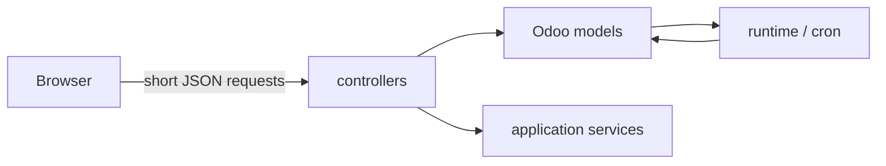

# Controllers

Controllers are the **thin transport boundary** between the browser (or a narrowly defined internal caller) and Odoo-owned application state.

They should answer: *“How does a caller ask Odoo to do something?”* — not *“How is the agent implemented?”*



## Current controllers

| File | Main responsibility |
|---|---|
| `turn_runtime.py` | runtime/account status, enqueue turn, turn status/cancel, plan approval/status |
| `turn_live.py` | authenticated projection of public activity and provisional answer deltas |
| `chat_bridge.py` | history, model preference, autonomy/policy preference endpoints |
| `chat_history_actions.py` | owned conversation deletion |
| `internal_tools.py` | residual bounded machine-authenticated instance-inventory callback |

Browser-facing routes use Odoo authentication (`auth="user"`) and return sanitized product errors rather than leaking raw exceptions.

### Important route families

```text
/odoo_ai/v1/turn
/odoo_ai/v1/turn/status
/odoo_ai/v1/turn/live
/odoo_ai/v1/turn/cancel
/odoo_ai/v1/turn/plan-decision
/odoo_ai/v1/chat-history
/odoo_ai/v1/chat-delete
/odoo_ai/v1/runtime-status
/odoo_ai/v1/runtime-account
```

## Controller design rules

A controller should normally:

1. validate the request shape;
2. rely on Odoo authentication/authorization;
3. call a model or application service;
4. translate expected failures to a small safe error code;
5. return quickly.

It should **not**:

- wait 30–120 seconds for a provider turn;
- implement the agent loop;
- execute business writes directly because the model requested them;
- use `sudo()` to make a browser action “work”;
- return provider stdout, prompts, secrets or private working transcript;
- become a second policy layer that can disagree with the capability host.

Long work belongs in durable turns claimed by cron.

## The residual internal inventory route

`internal_tools.py` is intentionally different: it exposes a bounded technical inventory route with `auth="none"` plus a shared-secret check. It is retained for Source/inventory compatibility lineage.

Treat it as **legacy-compatible plumbing**, not a recommended service-to-Odoo architecture. New product features should use the embedded Odoo runtime unless a new explicit boundary is designed.

## Adding a route

Before adding a route, ask whether an existing endpoint can represent the state/action. If a new route is needed:

- keep the input small and explicit;
- ensure ownership checks happen server-side;
- use stable public error codes;
- return only the projection the UI needs;
- add controller/model tests for malformed input and access denial;
- if the call triggers long work, persist it first and return a handle.

## Replacing the frontend

A different UI can consume these server contracts without replacing the agent runtime. The important invariant is that **client state is not authority**: a client may request cancel/approval/etc., but Odoo revalidates the turn/plan and user ownership.
