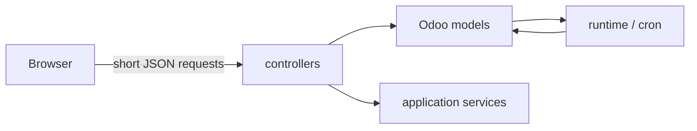

# Controllers

Controllers are the **thin transport boundary** between the browser (or a narrowly defined internal caller) and Odoo-owned application state.

They answer “How does a caller ask Odoo to do something?” — not “How is the agent implemented?”.



## Current controllers

| File | Main responsibility |
|---|---|
| `turn_runtime.py` | runtime/account status, enqueue turn, turn status/cancel, plan approval/status |
| `turn_live.py` | authenticated projection of public activity, provisional answer and readable-summary live data |
| `turn_control.py` | same-turn correction/redirect and explicit host-owned safe reversion requests |
| `public_references.py` | fresh Odoo revalidation of typed record/model/action/view/menu/setting references before navigation |
| `chat_bridge.py` | history, model preference, autonomy/policy preference endpoints |
| `chat_history_actions.py` | owned conversation deletion |
| `internal_tools.py` | residual bounded machine-authenticated instance-inventory callback |

Browser-facing routes use Odoo authentication (`auth="user"`) and return sanitized product errors rather than leaking raw exceptions.

### Important route families

```text
/odoo_ai/v1/turn
/odoo_ai/v1/turn/status
/odoo_ai/v1/turn/live
/odoo_ai/v1/turn/cancel
/odoo_ai/v1/turn/redirect
/odoo_ai/v1/turn/revert
/odoo_ai/v1/turn/plan-decision
/odoo_ai/v1/public-references
/odoo_ai/v1/chat-history
/odoo_ai/v1/chat-delete
/odoo_ai/v1/runtime-status
/odoo_ai/v1/runtime-account
```

## Current-turn control boundary

The browser names only the durable Odoo turn belonging to the active conversation. `/turn/redirect` persists a bounded `client_intervention_id` + correction on that same turn before any provider steering is attempted. `/turn/cancel` changes Odoo-owned cancellation state. `/turn/revert` requests an explicit host-side compensator for a previously verified reversible effect.

No route exposes Codex thread/turn IDs to the browser. Provider `turn/steer`/`turn/interrupt` remain host-internal transport controls.

## Navigation boundary

`/public-references` is the second authorization step for navigation. Discovery/activity/final-answer references are not sufficient authority to open a screen.

The browser sends one closed typed identity such as:

```text
odoo_record: model + record_id
odoo_model: model
odoo_action: action_id
odoo_view: view_id
odoo_menu: menu_id
odoo_setting: action_id + setting_field
```

Odoo validates exact shape, current user/company context, existence and the applicable ACL/record-rule/group/menu/settings conditions. Only then does it return a closed navigation descriptor for the frontend action service. Arbitrary model-authored routes/URLs are not accepted.

## Controller design rules

A controller should normally:

1. validate the request shape;
2. rely on Odoo authentication/ownership;
3. call a model or narrow application service;
4. translate expected failures to small safe error codes;
5. return quickly.

It should **not**:

- wait 30–120 seconds for a provider turn;
- implement the agent loop;
- execute business writes directly because the model requested them;
- use `sudo()` to make a browser business action/reference succeed;
- turn model text into an arbitrary Odoo route/action;
- return provider IDs/stdout/prompts/secrets/private working transcript;
- become a second policy layer that can disagree with the capability host.

Long work belongs in durable turns claimed by cron.

## Residual internal inventory route

`internal_tools.py` is intentionally different: it exposes a bounded technical inventory route with `auth="none"` plus a shared-secret check. It is retained for Source/inventory compatibility lineage.

Treat it as legacy-compatible plumbing, not the recommended service-to-Odoo architecture. New product features should use the embedded Odoo runtime unless a new explicit boundary is designed.

## Adding a route

Before adding a route, ask whether an existing endpoint can represent the state/action. If a new route is needed:

- keep input small and exact;
- ensure ownership checks happen server-side;
- use stable public error codes;
- return only the projection the UI needs;
- add controller/model tests for malformed input and access denial;
- if the call triggers long work, persist it first and return a handle.

## Replacing the frontend

A different UI can consume these server contracts without replacing the agent runtime. Client state is never authority: a client may request Stop/correction/approval/navigation/reversion, but Odoo revalidates the relevant durable turn/plan/reference/effect state.
