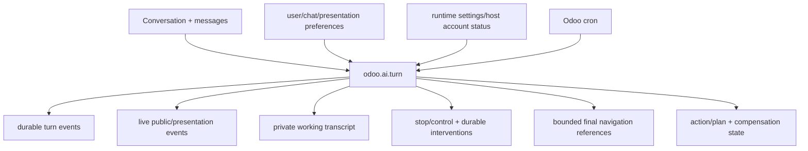

# Odoo models

This directory is the durable backbone of the Assistant. If the browser closes, a worker restarts or Codex disappears, important product state must remain reconstructable from Odoo.



## Main groups

### Conversation and user-facing preferences

- `chat_storage.py` — Odoo-native conversations/messages/history ownership.
- `chat_preferences.py` and `user_preferences.py` — user-level chat/model/autonomy preferences.
- `reasoning_preferences.py` — provider-backed reasoning-effort preference and turn capture.
- `activity_preferences.py` — semantic-activity detail/bounds/readable-summary display preferences, including the scrollable expanded-line count. Presentation only; never authority.
- `public_references.py` — fresh effective-user revalidation for `odoo_record`, `odoo_model`, `odoo_action`, `odoo_view`, `odoo_menu` and `odoo_setting`; returns only closed navigation descriptors.
- `turn_navigation.py` — bounded host capture/projection of validated contextual navigation references into final responses.
- `chat_policy.py` — policy-related product configuration and decisions.

### Durable turn execution and controls

- `turn_queue.py` — queue state, claiming/leases, cancellation, stale recovery and execution entry points.
- `turn_event.py` — durable turn events/status history.
- `turn_failure.py` — structured/sanitized terminal failure state.
- `turn_working_transcript.py` — bounded private state used to continue the host-owned loop.
- `turn_control.py` — durable Stop/redirect/effect-boundary/reversion control state and compatibility path for pre-intervention P5.8 control payloads.
- `turn_intervention.py` — ordered durable same-turn corrections with `client_intervention_id`, copied ownership bindings, idempotency and strict budgets.
- `turn_intervention_cleanup.py` — cleanup/retention integration for intervention rows.
- `turn_control_effect_boundary.py`, `turn_control_interrupt_persistence.py`, `turn_control_post_effect.py`, `turn_control_projection.py` — ordering, interruption persistence, post-effect semantics and browser-safe control/reversion projection.
- `turn_live_event.py` — independently committed browser-safe activity and provisional-answer events; semantic events may include bounded navigation references.
- `turn_reasoning_summary.py` — separate bounded readable-reasoning-summary live channel; raw/private reasoning is never accepted.

### Effects and compensation

- `action_execution.py` — persisted effect/action execution state and receipts around the controlled write lifecycle.
- `embedded_runtime_host_loop.py` — current ADR-019 composition; correlates provider reasoning, applies durable interventions, checks control state before the effect barrier and captures final navigation references.
- safe inverses are discovered as HOST-only `CapabilityDefinition`s in the runtime capability providers; turn reversion invokes them through the same executor/policy boundary and records success only after verification.

### Runtime configuration and diagnostics

- `embedded_runtime.py` — Odoo-side embedded runtime base integration.
- `runtime_settings.py`, `res_config_settings.py` — runtime configuration and read-only host account status.
- `runtime_diagnostics.py`, `assistant_diagnostics.py` — admin-facing health/diagnostic projections.

The exact class/model names and fields in code are authoritative; this README explains responsibility, not a database schema reference.

## Effective-user rule

Business operations, contextual navigation and compensation execute/revalidate under the effective user/company context with `su=False`. Technical persistence may use host-internal authority where required to maintain turn state, but it cannot expand business access.

Never use `sudo()` merely to make an agent operation/reference/compensation succeed. Technical persistence and user-authorized business execution are different authority domains.

## Turn state vs public UI state

Keep these separate:

- **Private working transcript:** typed information to continue/recover the agent loop.
- **Durable intervention rows:** ordered user corrections to the current turn; not provider state.
- **Durable status/events:** authoritative lifecycle facts.
- **Public activity:** sanitized host-owned facts, optionally with safe typed navigation references.
- **Provisional answer delta:** user-facing text, not final authority; retained as `Interrumpido` if Stop wins after text was shown.
- **Readable reasoning summary:** optional provider-declared presentation text on its own bounded channel.
- **Private/raw reasoning:** never persisted/projected to the browser.

This separation permits useful progress and responsive control without exposing chain-of-thought/provider internals or letting presentation/provider state affect effect certainty.

## Typed-reference rule

Public references are presentation descriptors, not navigation authority.

```text
stream/final typed reference
 -> browser sends reference back to Odoo
 -> public_references.py validates exact shape + current permissions/existence/visibility
 -> Odoo returns closed navigation descriptor
 -> browser actionService uses only that descriptor
```

The model never supplies an executable Odoo URL or route. A stale/revoked/deleted reference fails closed.

## Same-turn intervention rule

A correction while a turn is active does not create a second ordinary turn. It is persisted on the same `odoo.ai.turn` before a provider steer/restart is attempted. The provider may help responsiveness with `turn/steer`, but Odoo remains the source of truth and the correction survives disposable provider processes.

Corrections while approval is pending explicitly reject/supersede the old plan. The final intervention sequence is checked again before an effect barrier can be crossed.

## Compensation rule

There is no generic rollback model. A turn can offer reversion only if every completed reversible effect has an explicit current HOST-only compensator. Current patch/archive/unarchive compensators revalidate permissions and optimistic post-effect state, restore only bounded captured values and verify again before marking the reversion complete.

## Adding persistent state

Before creating a new model/field, decide:

1. Is it durable product truth or just a cache/presentation aid?
2. What user/company/conversation/turn owns it?
3. What ACL/record rule or host-internal boundary applies?
4. Does it need retention/cleanup?
5. Can a restart recover safely from it?
6. Is any content untrusted/sensitive?
7. Does it affect effect certainty, control ordering or approval binding?
8. Does a module-update/version path exist?

If data can be reconstructed cheaply and has no product/audit value, prefer runtime/browser derived state rather than another durable model.

## Decoupling

The reasoning provider can be replaced without replacing these models. The frontend can be replaced without moving durable state to JavaScript. That is intentional.
