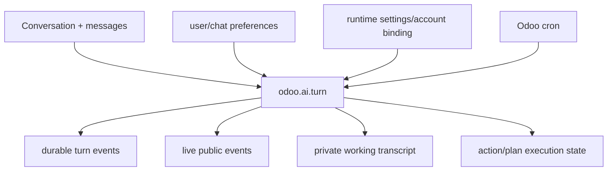

# Odoo models

This directory is the durable backbone of the Assistant. If the browser closes, a worker restarts or Codex disappears, the important product state must still be reconstructable from Odoo.

## Main groups

### Conversation and user-facing state

- `chat_storage.py` — Odoo-native conversations/messages/history ownership.
- `chat_preferences.py` and `user_preferences.py` — user-level chat/model/autonomy/policy preferences.
- `chat_policy.py` — policy-related product configuration and decisions.

### Durable turn execution

- `turn_queue.py` — queue state, claiming/leases, cancellation, stale recovery and execution entry points.
- `turn_event.py` — durable turn events/status history.
- `turn_failure.py` — structured/sanitized terminal failure state.
- `turn_working_transcript.py` — bounded private state used to continue the host-owned loop.
- `turn_live_event.py` — public activity/provisional answer events designed for live UI visibility.

### Effects

- `action_execution.py` — persisted effect/action execution state and receipts around the controlled write lifecycle.
- host-loop integration in `embedded_runtime_host_loop.py` connects durable turn state with the agent runtime.

### Runtime configuration and diagnostics

- `embedded_runtime.py` — Odoo-side embedded runtime integration.
- `runtime_settings.py`, `runtime_account_binding.py`, `res_config_settings.py` — configuration/account/activation state.
- `runtime_diagnostics.py`, `assistant_diagnostics.py` — admin-facing health/diagnostic projections.

The exact class/model names and fields in code are authoritative; this README explains responsibility, not a database schema reference.

## Why models own this much

The architecture deliberately avoids provider-owned or browser-only lifecycle state. Odoo already supplies:

- transactions;
- users/companies;
- ACLs and record rules;
- persistence;
- scheduler integration;
- admin inspectability.

That makes it the right place to hold durable Assistant state.

## Effective-user rule

Business operations are reconstructed under the user/company context captured by the turn and execute with `su=False`. Storing a turn as a technical model does **not** grant that turn broader business access.

Never use `sudo()` in a model merely to bypass a failed agent operation. Technical/admin maintenance and user-authorized business execution are different authority domains.

## Turn state vs public UI state

Do not mix these concepts:

- **Private working transcript:** enough typed information to continue/recover the agent loop.
- **Durable status/events:** authoritative lifecycle facts.
- **Public live events:** sanitized projection safe for the browser.
- **Provisional answer delta:** useful UI text, not final authority.

This separation is what allows useful progress without exposing chain-of-thought or provider internals.

## Adding persistent state

Before creating a new model/field, decide:

1. Is it durable product truth or just a cache?
2. What user/company owns it?
3. What ACL/record rule applies?
4. Does it need retention/cleanup?
5. Can a restart recover safely from it?
6. Is any content untrusted/sensitive?
7. Does it affect effect certainty or approval binding?
8. Does a migration/update path exist?

If the data can be reconstructed cheaply and has no product/audit value, it may belong in runtime memory/cache instead.

## Decoupling

The reasoning provider can be replaced without replacing these models. The frontend can be replaced without moving durable state to JavaScript. That is intentional.

Replacing Odoo-native turn persistence/queueing would be a major architecture change because recovery, approval and effect certainty currently depend on it.
