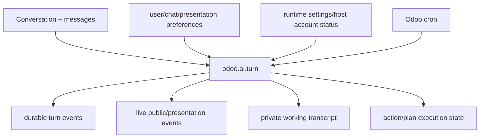

# Odoo models

This directory is the durable backbone of the Assistant. If the browser closes, a worker restarts or Codex disappears, important product state must remain reconstructable from Odoo.

## Main groups

### Conversation and user-facing preferences

- `chat_storage.py` — Odoo-native conversations/messages/history ownership.
- `chat_preferences.py` and `user_preferences.py` — user-level chat/model/autonomy preferences.
- `reasoning_preferences.py` — provider-backed reasoning-effort preference and turn capture.
- `activity_preferences.py` — P5.8 semantic-activity detail/bounds/readable-summary display preferences. Presentation only; never authority.
- `public_references.py` — fresh effective-user resolution of typed Odoo record/model references and generic safe record presentation.
- `chat_policy.py` — policy-related product configuration and decisions.

### Durable turn execution

- `turn_queue.py` — queue state, claiming/leases, cancellation, stale recovery and execution entry points.
- `turn_event.py` — durable turn events/status history.
- `turn_failure.py` — structured/sanitized terminal failure state.
- `turn_working_transcript.py` — bounded private state used to continue the host-owned loop.
- `turn_live_event.py` — independently committed browser-safe activity and provisional-answer events; P5.8 adds correlated semantic lifecycle projection.
- `turn_reasoning_summary.py` — separate bounded readable-reasoning-summary live channel. It never accepts raw/private reasoning.

### Effects

- `action_execution.py` — persisted effect/action execution state and receipts around the controlled write lifecycle.
- `embedded_runtime_host_loop.py` — current ADR-019 composition; P5.8 also correlates each provider reasoning pass with a host-generated activity ID and closes it on completion/failure.

### Runtime configuration and diagnostics

- `embedded_runtime.py` — Odoo-side embedded runtime base integration.
- `runtime_settings.py`, `res_config_settings.py` — runtime configuration and read-only host account status.
- `runtime_diagnostics.py`, `assistant_diagnostics.py` — admin-facing health/diagnostic projections.

The exact class/model names and fields in code are authoritative; this README explains responsibility, not a database schema reference.

## Effective-user rule

Business operations and typed public references are resolved under the effective user/company context with `su=False`. Technical persistence may use host-internal authority where required to maintain turn state, but it cannot expand business access.

Never use `sudo()` merely to make an agent operation/reference succeed. Technical maintenance and user-authorized business execution are different authority domains.

## Turn state vs public UI state

Keep these separate:

- **Private working transcript:** typed information to continue/recover the agent loop.
- **Durable status/events:** authoritative lifecycle facts.
- **Public activity:** sanitized host-owned facts; P5.8 groups them semantically in the browser.
- **Provisional answer delta:** user-facing text, not final authority.
- **Readable reasoning summary:** optional provider-declared presentation text on its own bounded channel.
- **Private/raw reasoning:** never persisted/projected to the browser.

This separation permits useful progress without exposing chain-of-thought/provider internals or letting presentation state affect effect certainty.

## P5.8 typed-reference rule

The live/public event may carry only bounded model/record identities already validated through capability output. Navigation still requires a fresh server resolution through `public_references.py`; current existence/read access is checked again immediately before the browser constructs a normal Odoo form/list action. Arbitrary model-generated routes are not accepted.

## Adding persistent state

Before creating a new model/field, decide:

1. Is it durable product truth or just a cache/presentation aid?
2. What user/company owns it?
3. What ACL/record rule applies?
4. Does it need retention/cleanup?
5. Can a restart recover safely from it?
6. Is any content untrusted/sensitive?
7. Does it affect effect certainty or approval binding?
8. Does a migration/update path exist?

If data can be reconstructed cheaply and has no product/audit value, prefer runtime/browser derived state rather than another durable model.

## Decoupling

The reasoning provider can be replaced without replacing these models. The frontend can be replaced without moving durable state to JavaScript. That is intentional.
