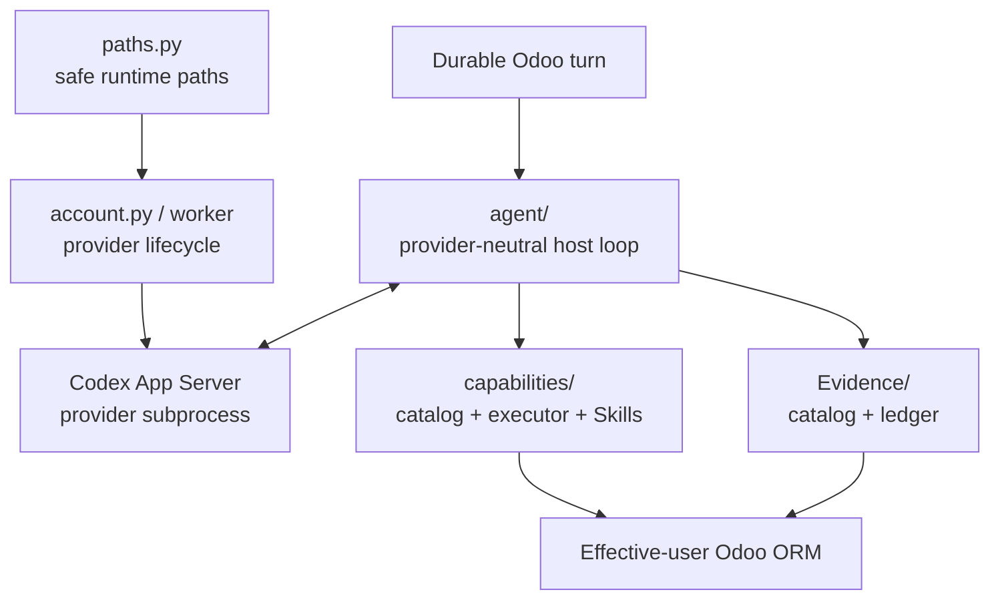

# Embedded runtime

`runtime/` is where probabilistic reasoning meets deterministic Odoo/host control. It runs **inside the Odoo addon/process lifecycle**; it is not a standalone Assistant server.



## Main parts

| Path | Responsibility |
|---|---|
| `agent/` | provider-neutral iterative decision loop, streaming/failure/public projections |
| `capabilities/` | executable capability contract, Skills/Context/Evidence extension framework, policy/execution |
| `context_source_policy.json` | default current-vs-historical source scope for P8 evidence/source intelligence |
| `codex.py` | lower-level Codex process/protocol support |
| `account.py`, `account_worker.py` | provider account/login/status lifecycle |
| `paths.py` | safe provider/runtime filesystem roots beneath Odoo `data_dir` |

## Operational model

Codex is currently the reasoning provider, but it is not the product authority. Odoo
persists the state needed to continue/recover turns and validates every model-visible
operation.

The runtime does not need:

- a FastAPI/Uvicorn Assistant service;
- a second Assistant PostgreSQL database;
- a shared machine-authenticated sidecar callback;
- Celery/Redis/RabbitMQ;
- a generic SQL/shell/Python bridge for the model.

## Authority model

```text
reasoning provider:  what should happen next?
capability host:     is this operation defined/available/valid?
Evidence layer:      what bounded evidence is available/fresh/accessible?
Odoo authority:      may this effective user read/change this resource?
```

Evidence, Skills, context and manifests do not grant authority. Even if retrieved
source/docs name a Python function, Odoo method or command, it is non-executable data
unless trusted host code exposes an effective typed capability.

Business operations use the effective Odoo Environment with `su=False`.

## P7/P8 extension model

Current composition is:

```text
CapabilityProvider
  +-- CapabilityDefinition[]
  +-- SkillDefinition[]
  +-- ContextProvider[]
  +-- EvidenceProvider[]
```

The provider API is versioned (`CAPABILITY_PROVIDER_API_VERSION = "1"`) and optional
provider/resource failures are isolated.

P8 Evidence currently provides common bounded contracts/catalog/routing/ledger and a
runtime/installation inventory provider. Live source/XML/log/Knowledge/web Evidence
belongs to later slices.

## Runtime filesystem

Mutable state belongs below the effective Odoo `data_dir`, conceptually:

```text
<odoo data_dir>/odoo_ai_assistant/
├── codex/
├── runtime/
├── cache/
└── source/
```

Provider credentials/cache must not be copied into source checkout, prompts or normal
PostgreSQL fields simply for convenience.

Future source/host operations must use explicit logical/managed roots and typed
capabilities; P8 Evidence locators are not permission to execute arbitrary paths.

## Extending the runtime

- New provider-neutral agent behavior → `agent/` behind existing contracts.
- New executable operation → `CapabilityDefinition`, normally through a provider.
- New procedural grouping → `SkillDefinition`.
- New JIT contextual projection → `ContextProvider`.
- New retrievable source/facts → `EvidenceProvider`.
- New reasoning provider → implement the provider seam; do not fork capability/policy logic.
- New host integration → prefer a high-level bounded operation, not a generic command primitive.

## Product profiles

Public product semantics currently expose only:

```text
User / non-technical
Technical
```

The future Technical/host privilege broker is a machine execution boundary, not a
third human product profile.

## What should remain detachable

The model provider, transport projections and UI are replaceable.

Odoo persistence, effective-user authority, `CapabilityDefinition`, durable
effect/recovery semantics and host-side validation are architectural invariants.

Read [`agent/README.md`](agent/README.md),
[`capabilities/README.md`](capabilities/README.md) and
[`../../../docs/EVIDENCE_ARCHITECTURE.md`](../../../docs/EVIDENCE_ARCHITECTURE.md)
next.
