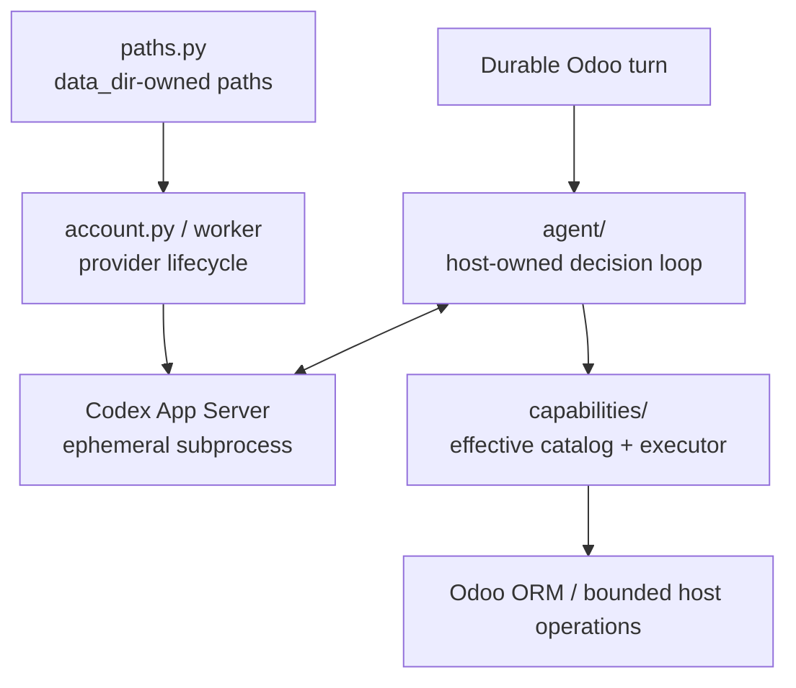

# Embedded runtime

`runtime/` is where probabilistic reasoning meets deterministic host control. It runs **inside the Odoo addon/process lifecycle**; it is not a standalone Assistant server.



## Main parts

| Path | Responsibility |
|---|---|
| `agent/` | provider-neutral host-owned iterative decision loop, streaming/failure/public projections |
| `capabilities/` | executable operation contract, discovery, effective catalog, validation, policy and execution |
| `codex.py` | lower-level Codex process/protocol support |
| `account.py`, `account_worker.py` | provider account/login/status lifecycle |
| `paths.py` | safe provider/runtime filesystem roots beneath Odoo `data_dir` |

## Operational model

Codex is currently the product reasoning provider, but it is **not a daemon owned by the product**. Product turns launch/use bounded provider processes and Odoo persists the state needed to continue or recover.

The runtime does not need:

- a FastAPI/Uvicorn Assistant service;
- a second PostgreSQL database;
- Celery/Redis/RabbitMQ;
- a generic SQL/shell bridge for the model.

## Authority model

The runtime separates three ideas:

```text
reasoning provider: “what should happen next?”
capability host:    “is this operation defined/available/valid?”
Odoo authority:     “may this user actually read/change this data?”
```

Even if the model names a Python function or Odoo method, that name has no authority unless a trusted `CapabilityDefinition` exposes the exact operation and the host makes it effective for the turn.

## Runtime filesystem

Mutable state belongs below the effective Odoo `data_dir`, conceptually:

```text
<odoo data_dir>/odoo_ai_assistant/
├── codex/
├── runtime/
├── cache/
└── source/
```

Do not write provider credentials/cache into the source checkout or PostgreSQL simply for convenience.

## Extending the runtime

- New provider-facing agent behavior → `agent/`, usually behind an existing port/contract.
- New executable operation → `capabilities/`.
- New reasoning provider → implement the provider seam; do not fork capability/policy logic.
- New host integration → prefer a high-level bounded capability/service rather than a generic command primitive.

## What should remain detachable

The model provider is intentionally replaceable. Capability transport projections are replaceable. UI is replaceable.

Odoo persistence, effective-user authority, durable effect semantics and host-side validation are architectural invariants rather than provider-specific details.

Read [`agent/README.md`](agent/README.md) and [`capabilities/README.md`](capabilities/README.md) next.
