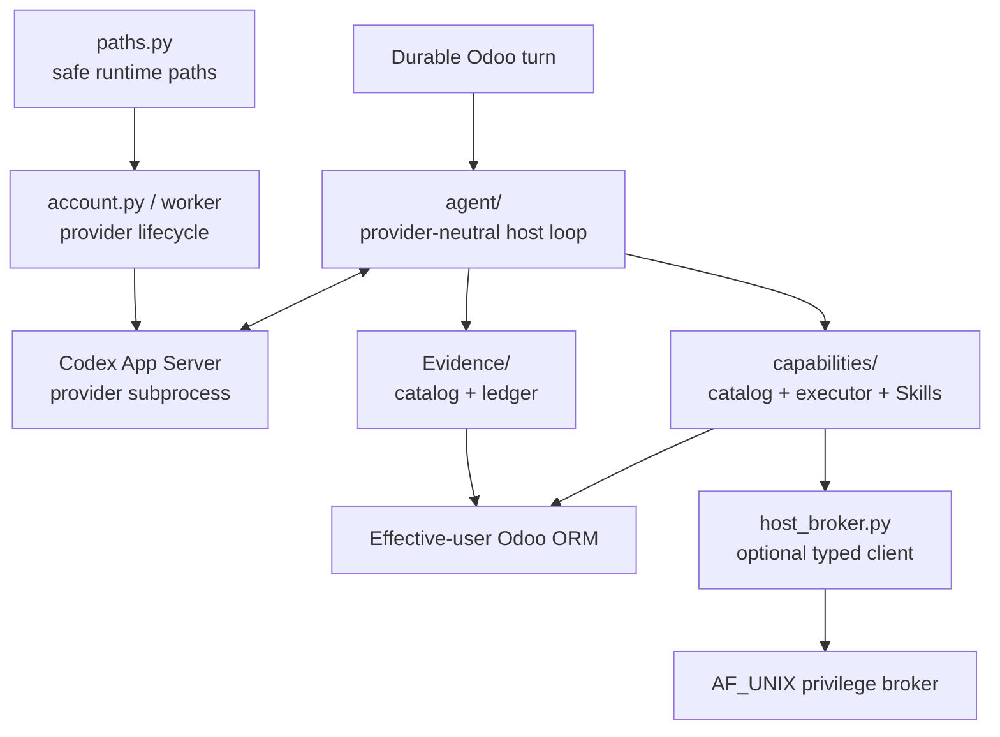

# Embedded runtime

`runtime/` is where probabilistic reasoning meets deterministic Odoo/host control. It runs **inside the Odoo addon/process lifecycle**; it is not a standalone Assistant server.



## Main parts

| Path | Responsibility |
|---|---|
| `agent/` | provider-neutral iterative decision loop, streaming/failure/public projections |
| `capabilities/` | executable capability contract, Skills/Context/Evidence extension framework, policy/execution |
| `host_broker.py`, `host_broker_wire.py` | bounded Odoo-side P10 client and wire validation for the optional broker |
| `context_source_policy.json` | default current-vs-historical source scope for Evidence/source intelligence |
| `codex.py` | lower-level Codex process/protocol support |
| `account.py`, `account_worker.py` | provider account/login/status lifecycle |
| `paths.py` | safe provider/runtime filesystem roots beneath Odoo `data_dir` |

## Operational model

Codex is currently the reasoning provider, but it is not the product authority. Odoo
persists the state needed to continue/recover turns and validates every model-visible
operation.

The runtime does not need:

- a FastAPI/Uvicorn Assistant service;
- a second Assistant PostgreSQL database;
- a shared machine-authenticated sidecar callback;
- Celery/Redis/RabbitMQ;
- a generic SQL/shell/Python bridge for the model.

The optional root `host_broker/` package is a finite machine adapter, not a restored
Assistant server. The embedded runtime talks to it only for accepted high-level
Technical capabilities.

## Authority model

```text
reasoning provider:  what should happen next?
capability host:     is this operation defined/available/valid?
Evidence layer:      what bounded evidence is available/fresh/accessible?
Odoo authority:      may this effective user read/change this resource?
broker policy:       may this exact privileged operation target this exact host resource?
```

Evidence, Skills, context and manifests do not grant authority. Even if retrieved
source/docs name a Python function, Odoo method, path or command, it is non-executable
data unless trusted host code exposes an effective typed capability and, where
required, broker policy resolves its logical target.

Business operations use the effective Odoo Environment with `su=False`.

## P7-P10 extension model

Current composition is:

```text
CapabilityProvider
  +-- CapabilityDefinition[]
  +-- SkillDefinition[]
  +-- ContextProvider[]
  +-- EvidenceProvider[]
```

The provider API is versioned and optional provider/resource failures are isolated.
P8/P9 provide runtime/source/log/Knowledge Evidence through the same extension seam.

P10 adds Technical-only Odoo-local diagnostics plus broker-backed config/service
capabilities. Broker-backed effects still use `CapabilityDefinition`, EffectPlan,
policy, durable binding, verification and recovery; no second capability registry is
introduced.

## Runtime filesystem

Mutable provider/runtime state belongs below the effective Odoo `data_dir`,
conceptually:

```text
<odoo data_dir>/odoo_ai_assistant/
├── codex/
├── runtime/
├── cache/
└── source/
```

Provider credentials/cache must not be copied into source checkout, prompts or normal
PostgreSQL fields.

Broker ledger, backups, policy and socket belong to deployment-owned paths outside the
model-writable runtime tree. Their reference locations are documented in
`../../../host_broker/README.md`.

Source/Evidence locators are never permission to execute arbitrary paths.

## Extending the runtime

- New provider-neutral agent behavior → `agent/` behind existing contracts.
- New executable operation → `CapabilityDefinition`, normally through a provider.
- New procedural grouping → `SkillDefinition`.
- New JIT contextual projection → `ContextProvider`.
- New retrievable source/facts → `EvidenceProvider`.
- New reasoning provider → implement the provider seam; do not fork capability/policy logic.
- New host integration → high-level typed operation + broker policy, never generic command composition.

## Product profiles

Public product semantics expose only:

```text
User / non-technical
Technical
```

The accepted optional Technical/host broker is a machine execution boundary, not a
third human product profile. Full autonomy cannot make broker-backed capabilities
available to a User profile.

## Host-effect certainty

An effectful broker request is bound to the durable EffectPlan step and precondition.
Once dispatch starts, transport/framing/receipt loss is `host_effect_uncertain`; it is
never ordinary unavailability or permission for a blind retry.

The broker's durable ledger returns the same terminal receipt for the exact request,
denies changed replay and treats unresolved running requests as uncertain.

## What should remain detachable

The model provider, transport projections, broker deployment adapter and UI are
replaceable.

Odoo persistence, effective-user authority, `CapabilityDefinition`, durable
effect/recovery semantics and host-side validation are invariants.

Read [`agent/README.md`](agent/README.md),
[`capabilities/README.md`](capabilities/README.md),
[`../../../docs/EVIDENCE_ARCHITECTURE.md`](../../../docs/EVIDENCE_ARCHITECTURE.md) and
[`../../../docs/adr/ADR-024-technical-host-privilege-broker.md`](../../../docs/adr/ADR-024-technical-host-privilege-broker.md)
next.
