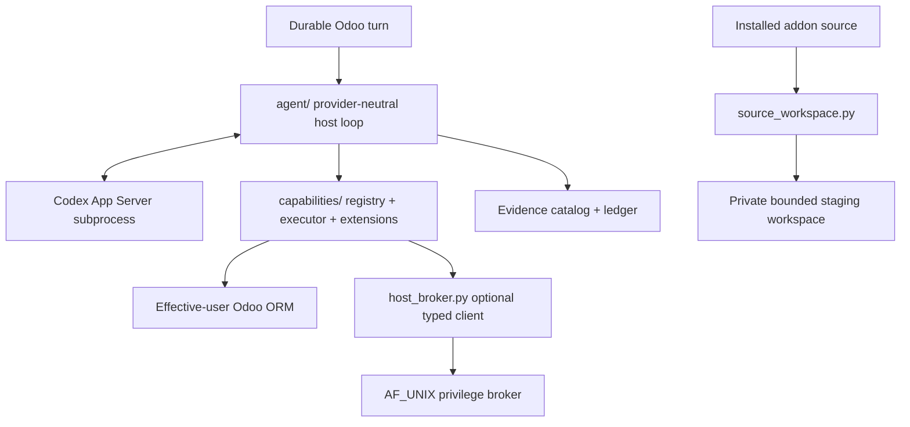

# Embedded runtime

`runtime/` is the deterministic host boundary around probabilistic reasoning. It runs
inside the Odoo addon/process lifecycle; it is not a standalone Assistant service.



## Main parts

| Path | Responsibility |
| --- | --- |
| `agent/` | provider-neutral iterative decision loop, streaming/failure/public projections |
| `capabilities/` | executable capability contract, Skills/Context/Evidence, policy/execution |
| `host_broker.py`, `host_broker_wire.py` | bounded P10 privileged-operation client/wire contract |
| `source_workspace.py` | P12.1 stdlib-only installed-addon snapshot/workspace boundary |
| `paths.py` | Odoo-owned private runtime/cache/source filesystem layout |
| `account.py`, `account_worker.py`, `codex.py` | current Codex provider lifecycle |

## Authority

```text
reasoning provider   proposes next work
capability host      validates typed operation/schema/policy
Odoo                 owns business permissions/state
Evidence             supplies bounded untrusted facts
P10 broker           owns finite privileged machine targets
P12 workspace store  owns bounded staging paths/fingerprints only
```

Business operations use the effective user with `su=False`. Evidence, Skills, file
contents and workspace metadata do not grant executable authority.

## P12.1 workspace rule

The runtime may copy a bounded installed-addon snapshot into:

```text
<data_dir>/odoo_ai_assistant/source/workspaces/<host id>/
```

The module root is resolved host-side through current installed-source/Odoo module
machinery. The store rejects source symlinks, root overlap, malformed relative paths,
special files and binding violations. It uses private permissions and deterministic
content fingerprints.

The ordinary Odoo runtime does **not** mutate the installed source through this module.
No P12 edit/test/deploy capability is registered in P12.1. Later slices must bind a
typed diff, test receipt and deploy request to exact workspace/source fingerprints.

Protected production deployment belongs behind a finite host adapter compatible with
ADR-024, not a general shell/Git/sudo bridge.

## Runtime filesystem

Conceptually:

```text
<odoo data_dir>/odoo_ai_assistant/
├── codex/          # managed fallback only when CODEX_HOME is not host-configured
├── runtime/
├── cache/
└── source/
    └── workspaces/ # P12 private staging snapshots
```

Provider credentials never belong in source workspaces, prompts or normal database
fields.

## Extension rule

- new executable behavior -> `CapabilityDefinition`/provider;
- new procedural grouping -> `SkillDefinition`;
- new JIT data -> `ContextProvider`;
- new retrieval -> `EvidenceProvider`;
- new privileged machine effect -> finite broker policy/operation;
- new source modification -> bounded workspace -> typed diff -> test receipt -> typed
  deploy, never arbitrary filesystem commands.
