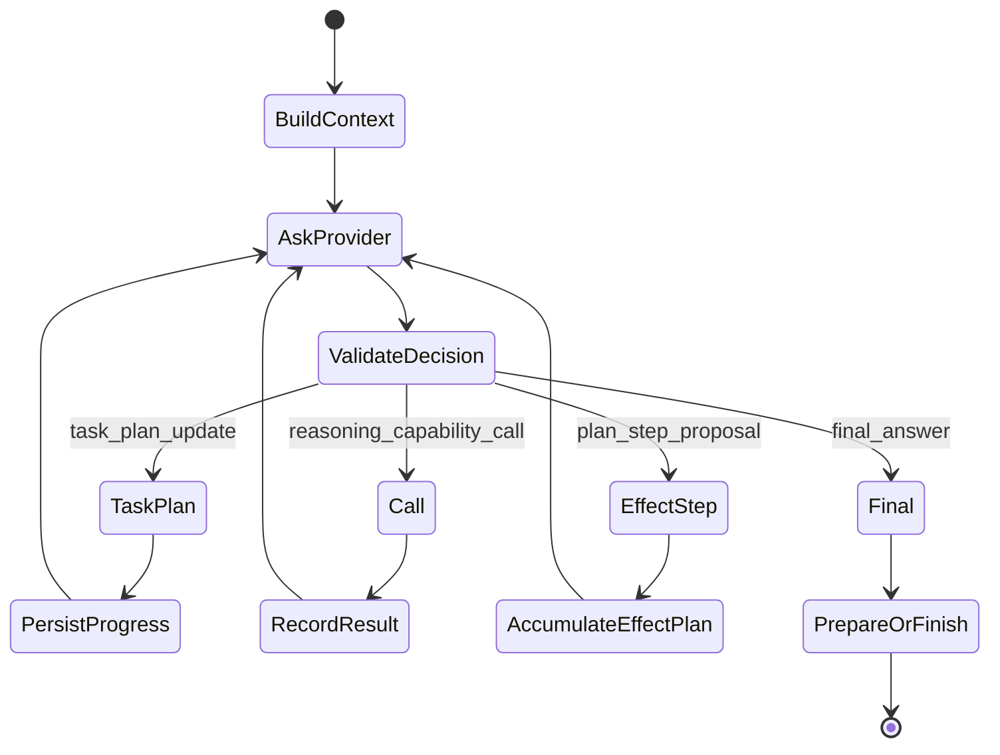

# Agent runtime

This directory implements the **host-owned provider-neutral agent loop**. A capable model chooses the next useful operation while Odoo owns sequencing, capability resolution, budgets, effects, approval, verification and recovery semantics.

The key idea from ADR-019 remains: **one untrusted decision at a time**.

## Mental model



Current provider-neutral `NextDecision` shapes are:

- `final_answer`
- `task_plan_update`
- `reasoning_capability_call`
- `plan_step_proposal`

The provider never returns an arbitrary program and never directly commits business effects.

## TaskPlan vs EffectPlan

They are intentionally different contracts.

### TaskPlan

`TaskPlan` is bounded user-visible progress structure:

```text
goal
revision
steps: step_id / title / state / depends_on
```

It has **no capability, arguments, approval or execution authority**. Revisions are host-validated and durable in the private working transcript. It is not chain-of-thought.

Visible planning is now an explicit product choice:

```text
Directo (adaptive)  default; no TaskPlan is available for a new turn
Plan (deliberate)   user opt-in; requires an initial TaskPlan before capability/effect work
```

Direct mode may still answer, inspect schema, perform several bounded reads, reason over their results and stage a short EffectPlan. The number of provider/tool calls does not promote a Direct turn into visible planning. In particular, a bounded chain such as “find the Demo contact; create it if absent; create a test quotation” remains planless unless the user selected Plan.

The former `auto` preference is legacy-read compatibility only. Existing stored values normalize to Direct for new turns, and historical snapshots remain parseable. Structural complexity can still be retained as diagnostic/eval evidence, but it does not activate TaskPlan.

### EffectPlan

Effect steps remain typed `CapabilityDefinition` proposals. The product host currently permits up to **5** ordered steps; callers without the Phase-6 policy opt-in remain single-step for compatibility.

Every step keeps capability/version/validated arguments, preview, preconditions, risk/effect, approval requirement, verification and result. No generic script body replaces typed capabilities.

For the currently supported Odoo-local effects, execution is one Odoo business transaction after one durable write barrier. Future external/non-transactional segmentation belongs to P6.4 and must not be described as atomic before that work exists.

## Important files

| File | Role |
|---|---|
| `service.py` | provider-neutral host loop, TaskPlan/EffectPlan accumulation and budgets |
| `contracts.py` | typed `NextDecision` contract |
| `task_plan.py` | closed non-authoritative TaskPlan contract |
| `planning.py` | Direct/Plan strategy and host-owned TaskPlan availability/revision rules |
| `decision_validation.py` | host validation of provider decisions |
| `working_transcript.py` | bounded private continuation state |
| `budgets.py` | Safety / Exploration / Cost / Latency / Response ceilings |
| `plan.py` | typed EffectPlan prepare/execute/verify integration |
| `post_effect.py` | verified-receipt continuation with PLAN authority removed |
| `compensation.py` | explicit HOST-only reverse-order compensators for eligible completed effects |
| `codex_decision.py` | Codex App Server adapter for the neutral decision contract |
| `interactive_codex.py` | Codex-specific steer/interrupt responsiveness |
| `codex_streaming.py` | Codex answer/reasoning streaming integration |
| `public_activity.py` | browser-safe host activity contract |

Exact ownership can evolve; current code is the final reference.

## Working transcript vs conversation history

They solve different problems:

- **Conversation history** is user-facing chat memory.
- **Working transcript** is private typed state required to continue one active host loop: TaskPlan revisions, decisions, capability calls/results, staged effect proposals, prepared plans and verified receipts.

The transcript is not a chain-of-thought store and must not be exposed wholesale as public progress.

## Provider boundary

A provider receives bounded context, effective reasoning/planning capability descriptors, working items and remaining budgets, then returns one neutral `NextDecision`.

Another provider can replace Codex by implementing the same `NextDecisionEngine`; it does not need a duplicated Odoo agent runtime.

Provider-specific code may own transport features such as Structured Outputs translation, model options, streaming, provider errors and steering. It must not own business authorization.

`PlanningDecisionEngine` projects `task_plan_available` as host-owned contract data. In Direct mode the TaskPlan branch is removed from the provider wire schema for a new turn, so planning behavior is not merely a prompt convention.

## Capability calls

For a reasoning call the host:

1. resolves the named definition from the **effective** catalog;
2. validates its input schema and call/budget constraints;
3. executes through `CapabilityExecutor` with `ExecutionAuthority.REASONING`;
4. records a typed result or safe error;
5. asks the provider what to do next.

A hidden/disabled capability cannot be invoked merely because the model guessed its name.

## Effect lifecycle

A `plan_step_proposal` is stage-only. Distinct proposals may accumulate into the bounded EffectPlan, but nothing executes until the host completes the normal lifecycle:

```text
propose typed steps
 -> prepare / preview / bind preconditions
 -> policy / approval
 -> revalidate each step
 -> one durable write barrier for current Odoo-local unit
 -> execute under effective user
 -> verify every step
 -> verified-effect receipt
 -> REASONING-only continuation
 -> natural final answer
```

A TaskPlan update cannot grant authority or clear safety failures.

## Budget families

`budgets.py` separates:

```text
SafetyBudget
ExplorationBudget
CostBudget
LatencyBudget
ResponseBudget
```

The current Cost/Latency families initially bound provider decisions; they are explicit seams for later provider telemetry rather than hidden magic numbers. Remaining counters are advisory provider context; the host owns enforcement.

## Streaming and public activity

Two projections remain separate:

- **activity** — sanitized host-known work classes;
- **answer deltas** — provisional user-visible text.

TaskPlan is a separate product-plan artifact. Phase 6 does not turn private reasoning into activity.

The first provider decision is also the semantic route: it may answer directly, request the minimum authoritative Odoo reads, or begin bounded effect work. Direct model answers publish no generic "Thought" activity. Short Odoo lookups and short action chains may use several tightly scoped capabilities without creating a TaskPlan; public work starts only after the host accepts a non-final decision.

Exact social messages such as a greeting, thanks, or farewell additionally use a final-answer-only provider contract. The constraint stays deliberately narrow: a greeting combined with a business request still enters the normal semantic route.

## Latency note

Removing artificial TaskPlans avoids extra orchestration, but it does not by itself make provider generation instantaneous. The current one-`NextDecision` host loop may still require several provider round-trips for schema/read/effect chains, and the Codex adapter currently starts an ephemeral App Server/thread for each decision. Optimize that boundary from measured timings and evals rather than reintroducing a rigid intent router or making TaskPlan automatic again.

## Failure semantics

Provider failures are normalized into bounded product state. Preserve useful category/status/retryability facts, but never make raw provider output the public failure contract.

After an effect becomes ambiguous, do not convert a provider/runtime error into “safe to retry.” Effect certainty is owned by Odoo.

## Extending/replacing the agent layer

Good changes preserve:

- the provider-neutral `NextDecisionEngine` port;
- one host-validated decision at a time;
- `CapabilityRegistry`/`CapabilityExecutor` as the execution path;
- TaskPlan as explicit non-authoritative progress only;
- bounded typed EffectPlan steps;
- host-owned budget/policy/approval/recovery semantics;
- separate private state and public projections.

Avoid reintroducing rigid `GENERAL / QUERY / HOW_TO / ACTION` routing or provider-specific copies of the core agent loop.