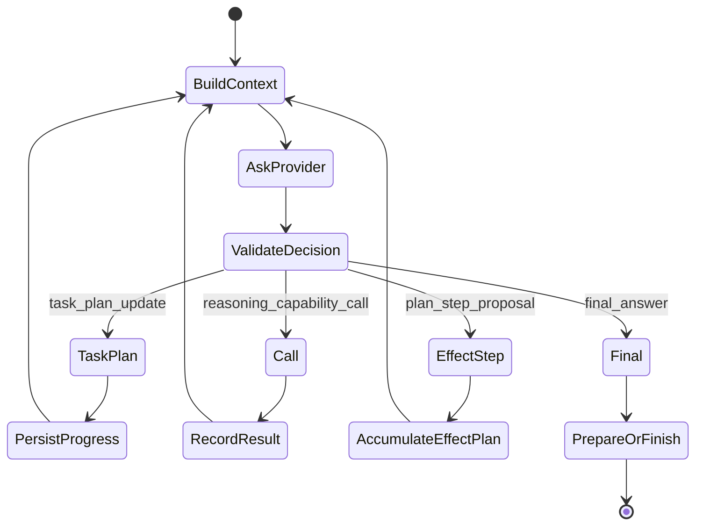

# Agent runtime

This directory implements the **host-owned provider-neutral agent loop**. The model
chooses a proposed next step; Odoo owns sequencing, effective capabilities, budgets,
Evidence/context projection, effects, policy/approval, verification and recovery.

The ADR-019 principle remains: **one untrusted decision at a time**.

## Mental model



Current provider-neutral `NextDecision` shapes are:

- `final_answer`
- `task_plan_update`
- `reasoning_capability_call`
- `plan_step_proposal`

The provider never returns an arbitrary executable program and never directly commits
business effects.

## Context, Skills and Evidence

Before a provider decision the host builds a bounded projection from:

```text
conversation + screen hints
immutable turn settings
ProviderProfile / EffectiveAssistantManifest
active Skill instructions
selected ContextProvider data
working transcript
selected Evidence refs/items
remaining budgets
```

Skill instructions are trusted installed-code behavior guidance, not authority.
ContextProvider and Evidence content are untrusted data. They cannot create/reveal
hidden capabilities, grant permissions, approve an effect or redefine host policy.

P8 introduces `EvidenceProviderCatalog`, `EvidenceRoutingPolicy` and bounded
`EvidenceLedger` as provider-neutral seams. The foundation exists, but ordinary
model-driven turns do not yet constitute a complete end-to-end Evidence/citation
product merely because the contracts are present.

## TaskPlan vs EffectPlan

They are separate contracts.

### TaskPlan

`TaskPlan` is bounded user-visible orchestration/progress:

```text
goal
revision
steps: step_id / title / state / depends_on
```

It has no capability arguments, approval or execution authority and is not
chain-of-thought.

Current product behavior keeps Direct as the normal strategy and supports explicit
one-turn deliberate/Plan behavior according to the accepted P7 product contract.
The host decides whether TaskPlan is available in the provider schema; it is not a
prompt-only convention.

### EffectPlan

Effect steps are typed `CapabilityDefinition` proposals. The host supports bounded
multi-step plans and explicit recovery-unit semantics.

Every step retains capability/version/validated args, preview, preconditions,
risk/effect classification, policy/approval requirement, execution result and
verification. No generic script body replaces typed capabilities.

## Provider boundary

A provider receives only bounded effective state and returns a neutral
`NextDecision`. Another provider can replace Codex by implementing the same reasoning
seam without duplicating Odoo policy/capabilities/turn persistence.

Provider-specific code may own:

- App Server transport/protocol;
- Structured Outputs translation;
- model/reasoning settings;
- answer/reasoning presentation events;
- provider errors/rate limits;
- steer/interrupt mechanics.

It must not own Odoo business authorization or tool-policy truth.

## Capability calls

For a reasoning capability call the host:

1. resolves the named definition from the **effective** registry;
2. validates input schema/configuration/guard/dependencies;
3. checks call/resource budgets;
4. executes through `CapabilityExecutor` with reasoning authority;
5. validates/bounds the result or safe error;
6. records typed continuation state;
7. asks the provider for the next decision.

A disabled/hidden/unauthorized operation cannot be invoked merely because the model
or retrieved Evidence names it.

## Effect lifecycle

A `plan_step_proposal` is stage-only. The normal effect path is:

```text
propose typed steps
 -> prepare / preview / bind preconditions
 -> policy
 -> approval when policy requires it
 -> revalidate
 -> durable write barrier / recovery unit
 -> execute under effective user
 -> verify
 -> verified receipt / EffectJournal / recovery state
 -> REASONING-only continuation
 -> natural final answer
```

Approval is policy/autonomy-driven. Full-control may remove redundant confirmation
for a permitted auto-executable operation; it does not bypass ACLs/record rules,
companies, field access or hard safety conditions.

Persisted ambiguous effects are never blindly retried.

## Recovery units

The accepted runtime distinguishes host-declared recovery semantics such as:

```text
odoo_atomic
segmented
external / uncertain
```

The host knows when rollback/no-surviving-effect is provable. Provider failure alone
is not evidence that an effect did not occur.

## Working transcript vs conversation history

- **Conversation history** is user-facing chat continuity.
- **Working transcript** is bounded private typed state needed to continue/recover one active host loop.
- **EvidenceLedger** is bounded provenance/freshness/citation state for selected Evidence.

None is a private chain-of-thought archive.

## Budget families

The host separates:

```text
SafetyBudget
ExplorationBudget
CostBudget
LatencyBudget
ResponseBudget
```

Provider-visible remaining values are context only. Enforcement remains host-side.

## Streaming and public activity

Keep distinct:

- **public activity** — sanitized host-observed work classes;
- **TaskPlan** — optional high-level orchestration;
- **readable reasoning summary** — bounded provider-presented text when enabled;
- **answer delta** — provisional user-visible response text;
- **final answer** — authoritative validated terminal response.

Public activity may say analyzing, retrieving, consulting Odoo, preparing, awaiting
approval, executing or verifying. It must not expose private chain-of-thought, raw
prompts, credentials or sensitive tool/Evidence payloads.

## Stop and same-turn correction

Durable user control is Odoo-owned. A same-turn correction is persisted before
provider steering/restart is attempted. Approval-pending corrections supersede the
old prepared plan, and the latest accepted intervention state is checked before an
effect barrier.

Provider steer/interrupt improves responsiveness but is not the source of truth.

## Product profiles

The provider-facing/public profile projection has exactly:

```text
User / non-technical
Technical
```

Historical internal compatibility profile values may map to those two. A future host
privilege broker is an execution boundary, not a third user persona.

## Important files

| File | Role |
|---|---|
| `service.py` | provider-neutral host loop and decision/effect coordination |
| `contracts.py` | typed `NextDecision` contract |
| `task_plan.py` | closed non-authoritative TaskPlan |
| `planning.py` | host-owned planning strategy/availability rules |
| `decision_validation.py` | provider-decision validation |
| `working_transcript.py` | bounded private continuation state |
| `budgets.py` | budget families/ceilings |
| `plan.py` | typed EffectPlan prepare/execute/verify integration |
| `post_effect.py` | verified-receipt continuation with effect proposal authority removed |
| `compensation.py` | explicit HOST-only safe compensators |
| `codex_decision.py` | Codex adapter to the neutral decision contract |
| `interactive_codex.py` | Codex steer/interrupt integration |
| `codex_streaming.py` | Codex answer/reasoning streaming integration |
| `public_activity.py` | browser-safe activity projection |

Exact ownership in code is authoritative.

## Extending the loop

Do not add a rigid GENERAL/QUERY/HOW_TO/ACTION router. Add behavior through the
existing provider-neutral loop, capability/Skill/Context/Evidence framework and host
policy.

For new Evidence-aware behavior, keep routing source classes separate from intent
classification: `EvidenceRoutingPolicy` may prioritize runtime/source/docs/logs/web,
but the model can continue investigating and the host can require local proof when
needed.

## Validation

P7 agent/product behavior is accepted. The P8 Evidence foundation is implemented but
its focused tests and P8 real gates remain pending. No code path or committed test
file is itself execution evidence.

See `../../../../docs/research/EXECUTION_STATE.md` for the exact next gate.
