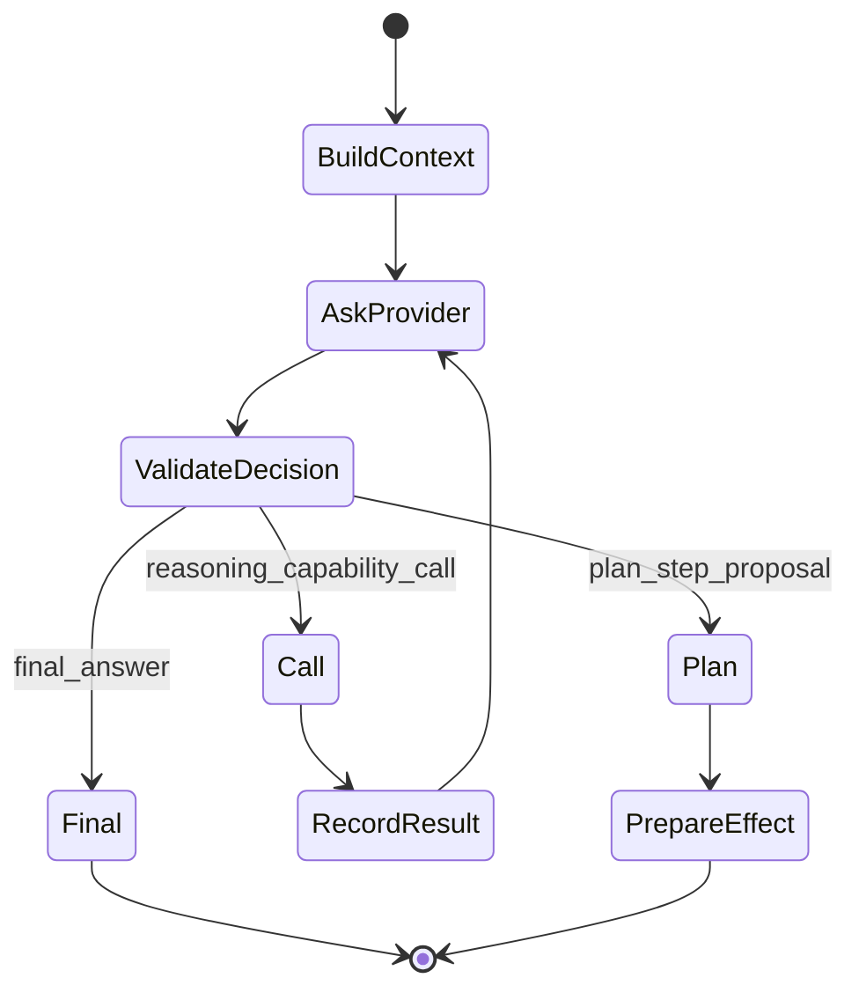

# Agent runtime

This directory implements the **host-owned agent loop**. It lets a capable model choose the next useful operation while keeping sequencing, capability resolution and effects under Odoo control.

The key idea from ADR-019 is: **one untrusted decision at a time**.

## Mental model

The current `NextDecision` shapes are:

- `final_answer`
- `reasoning_capability_call`
- `plan_step_proposal`

The provider does not return an arbitrary program and does not directly commit business effects.

## Important files

| File | Role |
|---|---|
| `service.py` | host loop/orchestration entry point |
| `provider.py` | provider-neutral `ReasoningProvider` protocol |
| `contracts.py` | typed decision/runtime contracts |
| `decision_validation.py` | host validation of provider decisions |
| `working_transcript.py` | bounded private continuation state |
| `plan.py` | canonical effect proposal/preparation integration |
| `codex_decision.py` | Codex implementation of the decision contract |
| `codex_streaming.py` | Codex streaming decision support |
| `answer_stream.py` | structured provisional final-answer delta extraction |
| `failure.py`, `provider_failure.py`, `terminal_failure.py` | normalized/sanitized failure semantics |
| `public_activity.py` | mapping trusted lifecycle facts to browser-safe activity |
| `model_catalog.py`, `auth_probe.py` | provider model/auth support |

Exact ownership can evolve; use code as the final reference.

## Working transcript vs conversation history

They solve different problems:

- **Conversation history** is the user-facing chat memory.
- **Working transcript** is private typed state needed to continue one active host loop: decisions, capability calls/results, prepared proposal/receipt, etc.

The working transcript is not a chain-of-thought store and must not be exposed as public progress.

## Provider contract

A reasoning provider receives bounded context, effective reasoning/planning capabilities, working items and remaining budgets, then returns one `NextDecision`.

That means another provider can replace Codex without gaining new authority. It must still operate inside this host loop.

## Capability calls

For a reasoning call the host:

1. resolves the named definition from the **effective** catalog;
2. validates its input schema and call/budget constraints;
3. executes through `CapabilityExecutor`;
4. records a typed result or safe error;
5. asks the provider what to do next.

A hidden/disabled capability cannot be invoked merely because the model guessed its name.

## Effect proposals

A `plan_step_proposal` is stage-only. It becomes useful only after host validation and the normal effect lifecycle.

Currently the product supports one canonical effect proposal/step. Multi-step `EffectPlan`, richer task planning and journals are later roadmap phases; do not document them as already active.

## Streaming and public activity

Two projections are intentionally separate:

- **activity** — sanitized host-known work classes such as capability use/verification;
- **answer deltas** — provisional user-visible text.

Neither can authorize an effect. The final validated/persisted outcome remains authoritative.

## Failure semantics

Provider failures are normalized into bounded product state. Preserve useful category/status/retryability facts, but never make raw provider output the public failure contract.

After effect execution becomes ambiguous, do not convert a provider/runtime error into “safe to retry.” Effect certainty is owned by the host.

## Extending/replacing the agent layer

Good changes preserve:

- `ReasoningProvider` or an equivalent provider-neutral port;
- one host-validated decision at a time;
- `CapabilityRegistry`/`CapabilityExecutor` as the execution path;
- bounded private working state;
- separate public projections;
- effect safety lifecycle.

Avoid reintroducing a rigid `GENERAL / QUERY / HOW_TO / ACTION` router. The direction is one agent that dynamically uses the effective capabilities available to it.
