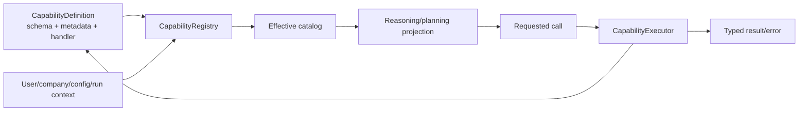
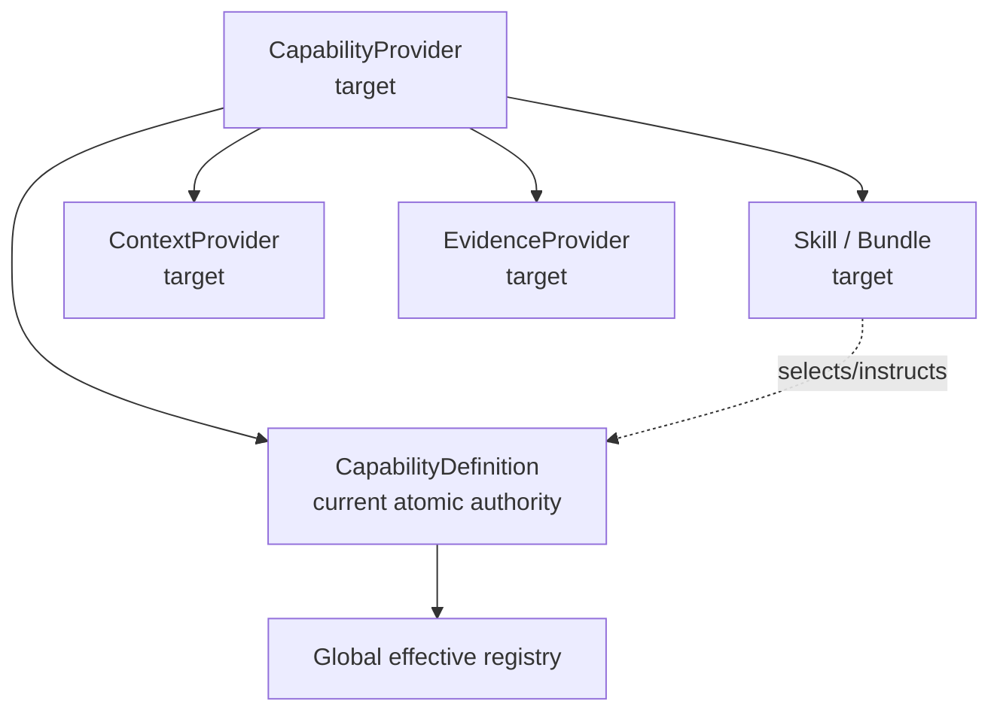

# Capability host

The capability host is the security and extensibility boundary between **“the model wants to do X”** and **“the product has a trusted, bounded operation that may do X.”**

`CapabilityDefinition` is the atomic executable unit.



## Files

| File | Responsibility |
|---|---|
| `contracts.py` | capability/context/metadata contracts |
| `decorators.py` | trusted declaration helper (`@tool(...)`) |
| `registry.py` | deterministic discovery and effective availability |
| `executor.py` | resolved execution with schema/budget/policy checks |
| `validation.py` | bounded schema/input/output validation |
| `policy.py` | capability/effect policy integration |
| `config.py` | capability configuration helpers |
| `providers/` | current executable core definitions |
| `adapters/` | projections/adapters for a consumer such as Codex |

See [`providers/README.md`](providers/README.md) and [`adapters/README.md`](adapters/README.md).

## What a definition means

Conceptually, one definition owns:

```text
stable name/version
model-facing + user-facing description
input/output JSON Schema
risk and effect classification
reasoning/planning/host exposure
approval semantics
groups / guards / dependencies / configuration
budgets / record-byte-time limits
trusted handler
optional preview/preconditions/verification/public activity
```

The exact dataclass in current code is authoritative.

## Reads and effects use the same framework

There is no separate “tool system” for reads and “action system” for writes. They are capabilities with different effect/risk metadata and lifecycle requirements.

This matters because future chat, MCP, automation or AI-field surfaces should project the **same definitions**, not synchronize multiple registries.

## Effective catalog

Discovery is not permission. `CapabilityRegistry` determines what is actually available for a run using trusted host facts: installed code, configuration, user/groups/companies, guards/dependencies, invocation context and other runtime constraints.

A capability can exist in code and still be absent from the model's effective catalog.

## Executor rule

Only execute a resolved effective definition with validated arguments.

For normal business capabilities:

```text
effective Odoo user
+ allowed companies
+ ACLs / record rules / field access
+ su=False
```

`sudo()` is not a fallback for an agent operation that fails authorization.

## Safe effects

Effect-capable definitions feed the host-owned lifecycle:


The LLM does not generate its own authority token or decide that verification is unnecessary.

## Adding a capability

A new core capability should normally require one trusted provider definition/handler plus tests, not edits to multiple manual registries.

Before adding it, define:

1. exact intent and scope;
2. input/output schema;
3. user/company authority;
4. risk/effect classification;
5. record/byte/call/time bounds;
6. preview/approval if it mutates;
7. verification and recovery;
8. safe public activity;
9. deterministic and, where model selection matters, agentic/real tests.

Prefer semantic operations (`confirm_sale_order`) for frequent business workflows over generic arbitrary method execution.

## Target extension architecture

Not all of this is implemented yet:



Target lifecycle for large catalogs:

```text
discovered -> available -> revealed -> active
```

A Skill/Bundle groups behavior and instructions; it **does not execute** and **does not grant permissions**.

## Do not add these shortcuts

- unrestricted `execute_method` / `execute_kw`;
- arbitrary SQL/Python/shell as normal agent tools;
- a second tool registry for MCP/automation/chat;
- permissions encoded only in prompt text;
- a provider that can self-register model-generated code as trusted execution.

For the deeper contract and future direction see [`../../../../docs/CAPABILITY_FRAMEWORK.md`](../../../../docs/CAPABILITY_FRAMEWORK.md).
