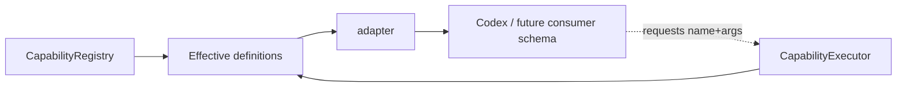

# Capability adapters

Adapters turn the trusted effective capability catalog into the shape expected by a consumer without creating another source of truth.

Today this folder includes the Codex-facing projection.

## Rule: projection, not authority

An adapter may change representation:

- names/descriptions;
- tool/function schema format;
- namespaces/prefixing;
- fields required by a provider protocol.

It must not decide that a hidden capability becomes executable, loosen schemas, bypass budgets or perform business writes itself.

## Future consumers

A future MCP, automation or other transport should normally be another **thin projection of the same effective catalog**, not another registry populated by synchronization jobs.

If a transport has different identity/context, ask the registry for a different effective catalog under that context; do not mutate the global definitions.

## Adding an adapter

Keep it:

- deterministic;
- side-effect free;
- easy to test from definition -> projected descriptor;
- explicit about provider feature limitations;
- independent from capability handler implementation.

Provider-specific quirks belong here or in the reasoning-provider adapter, not inside business capability handlers.
