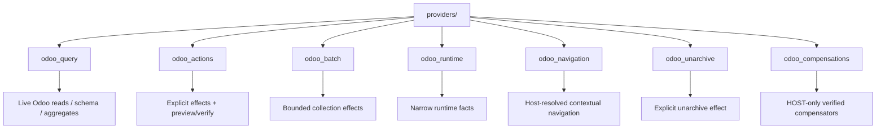

# Core capability providers

This folder contains executable capabilities shipped by the addon. The loader discovers definitions here deterministically; the agent runtime must not hard-code a parallel list.

## Current provider families



### `odoo_query.py`

Schema-first bounded reads against the live installation. Use live Odoo reads for frequently changing facts rather than copying them into RAG.

### `odoo_actions.py`

Explicit supported business mutations with preview/precondition/execution/verification semantics. It is **not** a wrapper around arbitrary ORM method execution.

Current patch/archive capabilities are declared `INTERNAL_REVERSIBLE` only because explicit matching HOST-only compensators exist and revalidate optimistic state before restoring it.

### `odoo_unarchive.py`

Explicit plan capability for setting a currently archived eligible record back to active state, with preview and post-write verification. Its inverse is also explicit; it does not expose a generic record method.

### `odoo_compensations.py`

HOST-only inverse capabilities for already verified safe reversible effects:

```text
odoo.record.patch.revert
odoo.record.archive.revert
odoo.record.unarchive.revert
```

They are discovered through the same `CapabilityDefinition` registry but have `HOST` exposure, so they are never shown to the reasoning model as callable tools. The host supplies the exact persisted original capability/version/arguments/preview/result/verification binding.

Compensation revalidates current effective-user access, checks the record still matches the verified post-effect state, restores only bounded captured prior values/state and verifies again. Later user edits cause a conflict rather than being overwritten.

There is no generic rollback capability.

### `odoo_navigation.py`

Read-only `odoo.resolve_navigation` resolves semantic user questions such as “dónde está Contactos” or “dónde configuro X” against the current installation.

The model can provide only bounded semantic query text, optional reference kinds and result limit. Odoo resolves concrete identities under the effective `su=False` user for:

```text
odoo_model
odoo_action
odoo_view
odoo_menu
odoo_setting
```

The result is presentation/reference data, not browser authority. Every click goes back through the public-reference resolver for fresh existence/ACL/group/menu/settings revalidation before a closed descriptor reaches `actionService`.

The provider never emits an authoritative arbitrary Odoo URL/route.

### `odoo_batch.py`

Bounded collection/batch operations under the same capability and authority rules. Large staged imports remain a later workflow; this provider must not become a path for thousands of unconstrained model-authored writes.

Scalar date and datetime inputs are normalized at the validated host boundary before ORM
execution. ISO-8601 UTC values therefore remain safe model inputs without leaking provider wire
format into Odoo's database datetime format, and verification compares canonical values.

### `odoo_runtime.py`

Narrow technical/runtime facts required for reasoning. It is deliberately not a filesystem, shell, secret or host-admin back door.

## Adding a provider file

For a new core vertical:

1. keep operations cohesive by domain;
2. declare trusted handlers with the framework decorator/contracts;
3. provide meaningful model-facing descriptions only for exposures the model may know;
4. bound schemas, records, bytes, calls and time;
5. rely on the effective Odoo user for business access;
6. add preview/verification for effects;
7. add focused tests;
8. verify discovery/conflict behavior;
9. if an operation is called reversible, provide and test an explicit safe compensator rather than assume an inverse;
10. if returning navigation/reference data, separate discovery from final host revalidation.

The current loader is scoped to trusted code inside this addon package. A first-class extension API for external installed addons is target work; do not simulate it by scanning arbitrary Python packages on the host.

## Generic vs semantic capabilities

Generic schema/query/create/patch primitives are useful horizontal fallback. Repeated business workflows should increasingly use semantic capabilities that capture eligibility and verification.

Example:

```text
preferred frequent workflow:
    confirm_sale_order(order_id)

fallback for uncommon safe data work:
    discover schema -> bounded generic operation
```

This reduces how much Odoo business procedure the model must reconstruct on every turn.

## Provider does not mean model provider

“Capability provider” here means a module contributing executable operations. It is different from the reasoning/model provider (Codex today).
