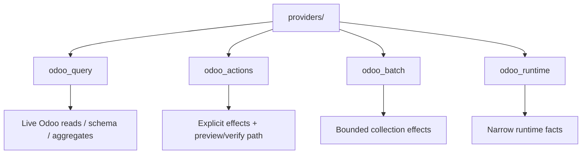

# Core capability providers

This folder contains the executable capabilities currently shipped by the addon. The loader discovers definitions here deterministically; the agent runtime should not hard-code a parallel list.

## Current providers



### `odoo_query.py`

Schema-first, bounded reads against the live installation. It exists so the assistant can discover real models/fields and query current business truth without a hard-coded catalog per Odoo module/version.

Use live Odoo reads for facts that change frequently rather than copying them into RAG.

### `odoo_actions.py`

Explicit supported business mutations. It supplies write schemas/preparation/verification semantics to the controlled effect path.

It is **not** a wrapper around arbitrary ORM method execution.

### `odoo_batch.py`

Bounded collection/batch operations under the same capability and authority rules. Large staged imports are a later workflow; this provider should not become a way to issue thousands of unconstrained model-authored writes.

### `odoo_runtime.py`

Narrow technical/runtime facts required for reasoning. It is deliberately not a filesystem, shell, secret or host-admin back door.

## Adding a provider file

For a new core vertical:

1. keep operations cohesive by domain;
2. declare trusted handlers with the framework decorator/contracts;
3. provide meaningful model-facing descriptions;
4. bound schemas, records, bytes, calls and time;
5. rely on the effective Odoo user for business access;
6. add preview/verification for effects;
7. add focused tests;
8. verify discovery/conflict behavior.

The current loader is scoped to trusted code inside this addon package. A first-class extension API for external installed addons is **target work**; do not simulate it by scanning arbitrary Python packages on the host.

## Generic vs semantic capabilities

Generic schema/query/create/patch primitives are useful horizontal fallback. Repeated business workflows should increasingly use semantic capabilities that capture eligibility and verification.

Example:

```text
preferred frequent workflow:
    confirm_sale_order(order_id)

fallback for uncommon safe data work:
    discover schema -> bounded generic operation
```

This reduces how much Odoo business procedure the model has to reconstruct on every turn.

## Provider does not mean model provider

“Capability provider” here means a module contributing executable operations. It is different from the reasoning/model provider (Codex today).
