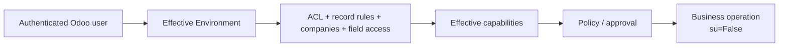

# Security

This directory defines Assistant-owned Odoo access control and one residual compatibility authentication mechanism.

Security is broader than this folder: the core product boundary also depends on effective-user Odoo `Environment`, record rules/field access, capability availability, policy, approvals, write barriers and verification.

## Current files

| File | Purpose |
|---|---|
| `ir.model.access.csv` | model-level access rights for Assistant technical/user models |
| `chat_storage_security.xml` | conversation/message ownership rules |
| `user_preferences_security.xml` | user preference access/ownership |
| `machine_auth.py` | shared-secret validation retained for the bounded internal inventory callback |

## Normal product authority

The model is not in this authority chain.

## `sudo()` rule

Normal model-visible business capabilities must use the effective user and `su=False`. `sudo()` should never be introduced as a convenience to make agent operations pass.

A future privileged Developer/Operator capability requires a separate explicit technical authority profile and audit/policy design.

## Residual machine authentication

`machine_auth.py` supports `controllers/internal_tools.py`, a bounded `auth="none"` instance-inventory callback retained from Source/scanner lineage.

Important:

- it is **not** required for normal browser -> Odoo -> embedded runtime turns;
- it is not a template for new product endpoints;
- the shared secret must not be stored in prompts/logs/database fields;
- removing/replacing this residual path should be done with its remaining caller/compatibility need, not by weakening the boundary.

## When adding a model or endpoint

Check:

1. who owns the record;
2. which groups can read/write/create/delete;
3. company isolation;
4. whether returned fields may contain secrets;
5. whether a technical job later re-enters the effective user before business access;
6. whether public events expose only sanitized data.

Prompt instructions are not security controls. Retrieved documents, source code, logs and user text are untrusted data and cannot grant capabilities or bypass these rules.
