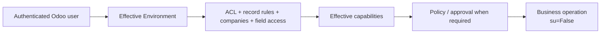

# Security

This directory defines Assistant-owned Odoo access control for the supported embedded product.

Security is broader than this folder: the product boundary depends on the effective-user Odoo `Environment`, ACLs,
record rules, field access, companies, capability availability, policy, approval when required, write barriers and
verification.

## Current files

| File | Purpose |
|---|---|
| `ir.model.access.csv` | model-level access rights for Assistant technical/user models |
| `chat_storage_security.xml` | conversation/message ownership rules |
| `user_preferences_security.xml` | user preference access/ownership |

## Normal product authority

The model is not in this authority chain. Full-control/autonomy may reduce redundant confirmation, but it never grants
permissions the effective Odoo user does not already have.

## `sudo()` rule

Normal model-visible business capabilities must use the effective user and `su=False`. `sudo()` must not be introduced
as a convenience to make agent operations pass.

Future host-level operations belong behind the proposed Technical/host privilege broker in ADR-024. That broker is a
technical execution boundary, not a third human product profile and not a replacement sidecar.

## Retired machine-auth callback

The old `controllers/internal_tools.py` `auth="none"` instance-inventory callback and its addon-local shared-secret
primitive have been removed from the supported product. Installation inventory is now collected in-process through P8
Evidence under the effective Odoo environment.

Historical `service/` or installer files may still mention the retired machine secret because those directories are kept
as historical/regression evidence. They must not be treated as current product authority or copied back into the addon.

## When adding a model, endpoint or capability

Check:

1. who owns the record or resource;
2. which groups can read/write/create/delete;
3. company isolation;
4. whether returned fields may contain secrets;
5. whether a technical job re-enters the effective user before business access;
6. whether public events expose only sanitized data;
7. whether Evidence/source/log/document content remains untrusted data;
8. whether a write needs preview, policy, approval and verification for its actual risk/autonomy profile.

Prompt instructions are not security controls. Retrieved documents, source code, logs, repository content and user text
cannot grant capabilities, permissions or approval.
