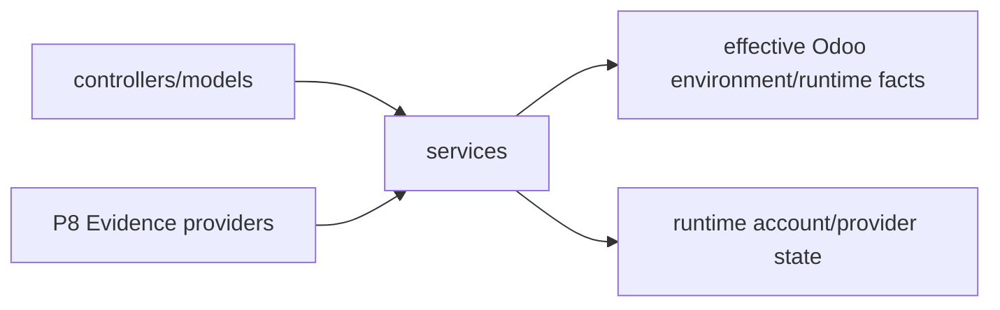

# Application services

`services/` contains small focused helpers between Odoo models/controllers and lower-level runtime concerns. A service is reusable implementation support; it is not automatically a model-visible executable capability.

## Current services

| File | Purpose |
|---|---|
| `screen_context.py` | validates/builds bounded context from the current Odoo screen |
| `turn_context.py` | assembles turn-level context used by the runtime |
| `runtime_account.py` | Odoo-facing Codex account/login/status gate and sanitized payloads |
| `instance_inventory.py` | bounded internal installation inventory reusable by P8 Evidence |

## Instance inventory

`instance_inventory.py` is now an **in-process service**. The retired
`controllers/internal_tools.py` `auth="none"` callback and its addon-local machine
secret are not part of the supported product.

`assistant.runtime_inventory` may reuse safe inventory facts, but it projects only a
bounded/sanitized subset under the effective user context. Legacy service payloads
must not leak absolute roots, credentials, commands or host-only details into model
Evidence.

## When code belongs here

A service is a good fit when it:

- composes several Odoo/runtime facts;
- is called from more than one model/provider/controller;
- has no durable product identity of its own;
- is not something the model should call directly.

If the model needs to select an operation, expose the allowed behavior through a
typed `CapabilityDefinition`. If the model needs retrievable facts, expose them
through a bounded `ContextProvider`/`EvidenceProvider` instead of exposing the service
implementation.

## Screen context is data, not authority

The browser may tell Odoo which model/view/record is on screen, but the server must
validate/reconstruct anything security-sensitive. Screen context helps relevance; it
cannot grant access to a record or capability.

`ContextProvider` and `EvidenceProvider` outputs preserve the same rule: retrieved or
screen-derived content is data, never permission/policy/approval.

## Decoupling

Services remain narrow. A future context/evidence/provider-account implementation may
replace an internal service as long as callers keep receiving the same bounded,
sanitary semantics. Avoid turning `services/` into a second orchestration layer.
