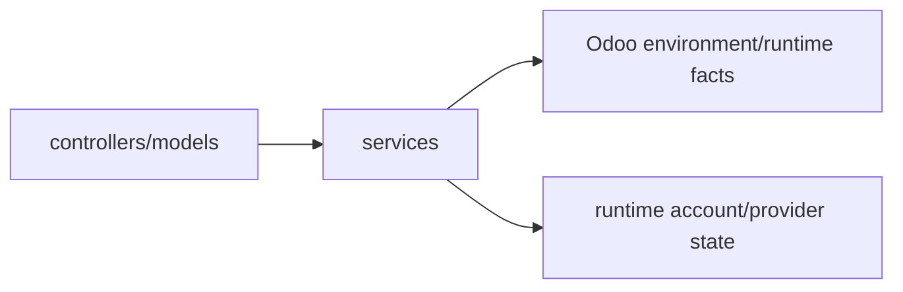

# Application services

`services/` contains small, focused helpers that sit between transport/models and lower-level runtime concerns. They are useful when behavior is reusable but does not need to become an Odoo model or an executable agent capability.

## Current services

| File | Purpose |
|---|---|
| `screen_context.py` | validates/builds bounded context from the current Odoo screen |
| `turn_context.py` | assembles turn-level context used by the runtime |
| `runtime_account.py` | Odoo-facing Codex account/login/status gate and sanitized payloads |
| `instance_inventory.py` | bounded technical inventory used by the residual source/inventory path |

## When code belongs here

A service is a good fit when it:

- composes several Odoo/runtime facts;
- is called from more than one model/controller;
- has no durable identity of its own;
- is not something the model should call as an executable operation.

If the model needs to select/execute it, wrap the allowed operation as a **capability** instead of exposing the service directly.

## Screen context is data, not authority

The browser may tell Odoo which model/view/record is on screen, but the server must validate/reconstruct anything security-sensitive. Screen context helps relevance; it cannot grant access to a record or capability.

The target architecture may add richer `ContextProvider` hooks per model. Those should preserve the same rule.

## Decoupling

These services are intentionally narrow. A future context implementation or provider account adapter can replace one service as long as its callers keep receiving the same bounded/sanitized semantics. Avoid making `services/` a generic dumping ground or second orchestration layer.
