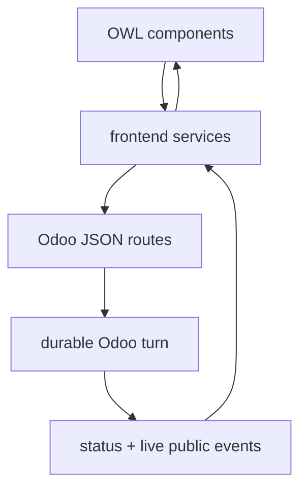

# Web client (`static/src`)

This is the Odoo web-client side of the Assistant: OWL components plus browser services that coordinate conversations, turns, settings, live activity and provisional answer text.

The browser is a **presentation and interaction layer**, not the execution authority.



## Structure

| Path | Purpose |
|---|---|
| [`components/`](components/) | render panel, history, markdown, controls, context and P5.1 multi-chat UI |
| [`services/`](services/) | browser-side state machines, RPC clients, stream/live consumers, preferences and turn scopes |
| `img/` | static imagery/assets |

## Product-state layers

The frontend deals with several kinds of state:

- selected conversation/history;
- current model/autonomy preferences;
- a turn's loading/cancel/approval/failure state;
- public activity;
- provisional answer stream;
- final persisted history.

Do not treat them as interchangeable. A provisional answer is allowed to disappear/reconcile with the final authoritative answer.

## P5.1 multi-chat state

The current `main` contains per-conversation execution scopes (`zzz_assistant_turn_scope_service.js` plus the additive multi-chat component patch). This is designed so Chat A can keep running while the user navigates/submits Chat B without A owning B's loading/activity/failure fields.

At this documentation snapshot the implementation is **landed but acceptance is still pending**. The web-client scopes are in-memory; later Phase 5 work expands durable reconnect/continuity.

## Live progress

The UI consumes a sanitized public event contract. Useful user-facing activity may say the class of work being done, but raw provider reasoning, prompts, capability arguments/results and secrets are never the progress protocol.

```text
good:  consulting Odoo / preparing action / verifying
bad:   raw hidden reasoning / raw provider stdout / secret-bearing args
```

## Error handling

Frontend failure contracts should display stable safe categories/actions and preserve effect uncertainty. Do not transform an ambiguous post-write failure into a friendly “nothing changed” message.

## Replacing/adding a surface

A new surface can reuse the same server runtime if it preserves:

- authenticated Odoo identity/context;
- durable conversation/turn ownership;
- server-side approval/cancel validation;
- sanitized public progress;
- final Odoo state as authority.

Avoid implementing a separate agent loop in JavaScript for a new UI.
