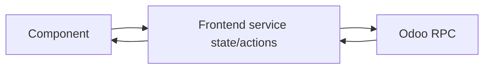

# OWL components

Components render the Assistant experience. They should stay focused on interaction and presentation while reusable state/network behavior lives in frontend services.

## Current component areas

| Directory | Purpose |
|---|---|
| `assistant_panel/` | main Assistant panel/composer and turn interaction |
| `assistant_history/` | conversation/history UI |
| `assistant_markdown/` | safe answer rendering |
| `assistant_model/` | model selection UI |
| `assistant_autonomy/` | autonomy/policy profile controls |
| `assistant_planning/` | composer `+` actions surface and explicit Plan-mode presentation |
| `assistant_view_context/` | current-screen/context presentation/integration |
| `zzz_assistant_multichat/` | additive P5.1 multi-chat UI patch |

The `zzz_*` name reflects current asset ordering/incremental rollout, not a desired permanent domain name. Refactor it only when the acceptance state and asset-order behavior are preserved.

## Component rule

A component should not duplicate server policy or capability semantics. It may decide *how* to present an approval, not whether an unapproved effect is allowed.

## Adding UI

Prefer:

- small OWL components with explicit props/state;
- accessibility and responsive behavior;
- stable service contracts;
- human-readable action previews and failure messages;
- tests for interaction branches.

Avoid displaying raw JSON/tool internals as the primary UX when a semantic card/message can explain the same thing.

## Composer add menu

The round `+` control at the left of the composer's lower action row is the product surface for optional per-chat features. Keep the button/menu generic so future attachments, image inputs or explicitly selected tools can be added without creating another row of permanent selectors.

For now the menu exposes only `Plan`. `Plan` toggles the existing planning preference between `deliberate` and the default `adaptive` mode; it does not introduce a second planning authority or bypass the turn settings snapshot. Active Plan state is indicated in the menu and on the `+` control.

## Approval UX

When rendering an effect proposal, make the user understand:

- what will happen;
- which records are affected;
- risk/important preconditions;
- whether execution is still pending;
- verified outcome afterward.

The server remains responsible for binding an approval to the actual proposal and revalidating before execution.

## Composer turn control

Submitting clears the visible draft before the network request starts, so an active turn immediately
exposes the stop control. If submission fails, the original draft is restored only when the user has
not already typed a replacement.
