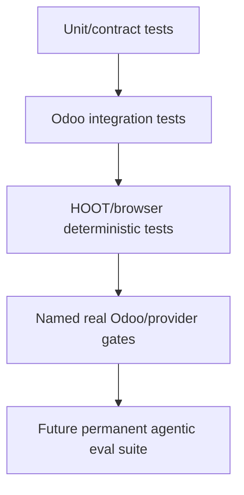

# Odoo/Python tests

These tests protect deterministic contracts of the addon: capability discovery/execution, host-loop decisions, queue/recovery, effects, failures, policy, persistence and provider adapters.

They are necessary but are **not the same as agentic evals**.

## What belongs here

Examples already present include tests for:

- capability framework/discovery;
- query/actions/batch behavior;
- capability action revalidation;
- canonical plan + host loop;
- Codex decision adapter;
- chat storage/preferences/policy;
- turn queue and failure persistence;
- runtime/account/diagnostic behavior.

## Testing layers



Each layer answers a different question.

- **Contract tests:** is deterministic code correct?
- **Odoo tests:** does it work under real ORM/security/transactions?
- **Browser tests:** does product state behave correctly in the web client?
- **Real provider gates:** does the supported Odoo/Codex path actually satisfy the claimed behavior?
- **Agentic evals:** does the model reliably choose good actions/evidence/outcomes across varied scenarios?

A green pytest suite cannot prove tool selection quality.

## Effect tests

For a mutating capability, test more than the happy write:

```text
preview
approval binding / policy
stale precondition
effective-user ACL denial
write barrier
execution
verification
timeout/cancel/restart
ambiguous outcome / recovery
```

Do not assert an unsafe automatic retry simply to make a flaky test pass.

## Roadmap acceptance

Named gates and current accepted evidence live under `docs/research/`. A feature that the roadmap marks “validation required” should not be described as accepted merely because implementation tests exist.

Current example: P5.1 turn-scoped frontend state has code/tests landed but still needs its specified HOOT/regression/browser acceptance.
