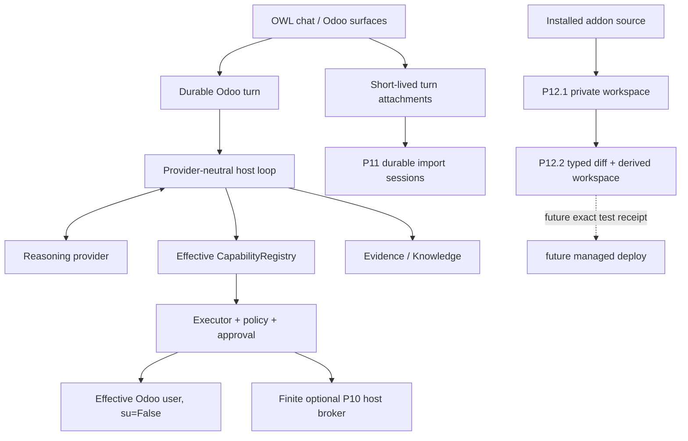

# Odoo AI Assistant documentation

Current code plus accepted ADRs are authoritative. Use this index for the supported
Odoo 18 product; dated reports and immutable evidence remain historical proof rather
than the current cursor.

## Current formal state

```text
P0-P11 COMPLETE / ACCEPTED
P12.1 BOUNDED SOURCE WORKSPACES FOCUSED ACCEPTED
P12.2 TYPED PATCH/DIFF IMPLEMENTED / VALIDATION PENDING
P12 NOT ACCEPTED
post-P11 spreadsheet/chat import breadth IMPLEMENTED / VALIDATION PENDING
```

P11 acceptance evidence:
[`research/evidence/phase11/2026-09-03/P11-ACCEPTANCE-72b4b82.md`](research/evidence/phase11/2026-09-03/P11-ACCEPTANCE-72b4b82.md).

P12.1 focused evidence:
[`research/evidence/phase12/2026-09-03/P12.1-FOCUSED-ad1378b.md`](research/evidence/phase12/2026-09-03/P12.1-FOCUSED-ad1378b.md).

The exact current cursor and unexecuted gates are in
[`research/EXECUTION_STATE.md`](research/EXECUTION_STATE.md).

## Primary reading path

1. [`CURRENT_STATE.md`](CURRENT_STATE.md) — current implementation snapshot.
2. [`ARCHITECTURE.md`](ARCHITECTURE.md) — runtime and authority boundaries.
3. [`PRODUCT_VISION.md`](PRODUCT_VISION.md) — product direction.
4. [`CAPABILITY_FRAMEWORK.md`](CAPABILITY_FRAMEWORK.md) — executable extension contract.
5. [`EVIDENCE_ARCHITECTURE.md`](EVIDENCE_ARCHITECTURE.md) — retrieval/Evidence contract.
6. [`KNOWLEDGE_INDEX.md`](KNOWLEDGE_INDEX.md) — company Knowledge.
7. [`adr/ADR-024-technical-host-privilege-broker.md`](adr/ADR-024-technical-host-privilege-broker.md) — finite privileged host boundary.
8. [`adr/ADR-025-controlled-source-workspaces.md`](adr/ADR-025-controlled-source-workspaces.md) — source workspace/deploy authority boundary.
9. [`research/P11_SPREADSHEET_CHAT_IMPORT_EXTENSION.md`](research/P11_SPREADSHEET_CHAT_IMPORT_EXTENSION.md) — post-P11 Excel/chat breadth and validation debt.
10. [`research/P12_SOURCE_WORKSPACE_FOUNDATION.md`](research/P12_SOURCE_WORKSPACE_FOUNDATION.md) — accepted P12.1 implementation contract.
11. [`research/P12_PATCH_DIFF_CONTRACT.md`](research/P12_PATCH_DIFF_CONTRACT.md) — implemented P12.2 contract.
12. [`research/P12.2_FOCUSED_VALIDATION_RUNBOOK.md`](research/P12.2_FOCUSED_VALIDATION_RUNBOOK.md) — immediate validation gate.
13. [`research/EXECUTION_STATE.md`](research/EXECUTION_STATE.md) — exact roadmap cursor.

## Current architecture at a glance



A spreadsheet attached through chat is a temporary artifact for the turn/import path,
not automatically a Knowledge source. A P12 staged patch is a private workspace effect,
not a production source deployment.

## Authority rule

A capability name, file, retrieved excerpt, workspace, model proposal or approved diff
never creates authority by itself. The host still validates effective user/group,
schema, policy, approval, binding, preconditions, execution and verification.

When documents disagree, prefer current code + accepted ADRs, then current subsystem
docs/tests/evidence, then dated research.
