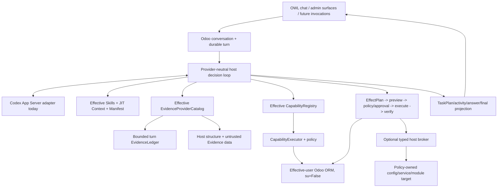

# Odoo AI Assistant documentation

This directory separates current implementation, architectural authority, product
direction and validation evidence.

## Current formal state

```text
P0-P10 COMPLETE / ACCEPTED
P10 PRIVILEGE-BOUNDARY ADR ACCEPTED
P10 TYPED HOST-OPERATIONS FIRST SLICE IMPLEMENTED
P10 MODULE-UPDATE MAINTENANCE ADAPTER IMPLEMENTED
P10 FOCUSED VALIDATION PASS
P10 REAL VALIDATION PASS
P11 READY FOR DESIGN
```

P9 remains accepted through `77d470febf67ddee46562907718dc47e975922bb`.
Its acceptance record is
[`research/evidence/phase9/2026-09-03/P9-ACCEPTANCE-77d470f.md`](research/evidence/phase9/2026-09-03/P9-ACCEPTANCE-77d470f.md).

P10 is accepted through `bde508b737c132140e237cdfde31aee9b37eca5f`. Its focused
and real broker/profile/config/service/PostgreSQL/privilege/module gates are recorded
in
[`research/evidence/phase10/2026-09-03/P10-ACCEPTANCE-bde508b.md`](research/evidence/phase10/2026-09-03/P10-ACCEPTANCE-bde508b.md).

## Primary reading path

1. [`CURRENT_STATE.md`](CURRENT_STATE.md) — implementation snapshot in human terms.
2. [`ARCHITECTURE.md`](ARCHITECTURE.md) — runtime and authority boundaries.
3. [`PRODUCT_VISION.md`](PRODUCT_VISION.md) — product direction and confirmed decisions.
4. [`CAPABILITY_FRAMEWORK.md`](CAPABILITY_FRAMEWORK.md) — executable/provider/Skill/Context/Evidence contract.
5. [`EVIDENCE_ARCHITECTURE.md`](EVIDENCE_ARCHITECTURE.md) — retrieval/Evidence contract.
6. [`KNOWLEDGE_INDEX.md`](KNOWLEDGE_INDEX.md) — P9 Knowledge lifecycle and retrieval.
7. [`adr/ADR-024-technical-host-privilege-broker.md`](adr/ADR-024-technical-host-privilege-broker.md) — accepted P10 privilege boundary.
8. [`research/P10_HOST_OPERATIONS_FIRST_SLICE.md`](research/P10_HOST_OPERATIONS_FIRST_SLICE.md) — implemented P10 scope and deferrals.
9. [`research/P10_FOCUSED_VALIDATION_RUNBOOK.md`](research/P10_FOCUSED_VALIDATION_RUNBOOK.md) — executed P10 gate contract.
10. [`research/evidence/phase10/2026-09-03/P10-ACCEPTANCE-bde508b.md`](research/evidence/phase10/2026-09-03/P10-ACCEPTANCE-bde508b.md) — P10 acceptance evidence.
11. [`research/EXECUTION_STATE.md`](research/EXECUTION_STATE.md) — exact roadmap cursor.

## Architecture at a glance



`CapabilityDefinition` remains executable authority. `CapabilityProvider`, Skills,
ContextProviders, EvidenceProviders, manifests and ledgers enrich reasoning but cannot
bypass registry, executor or policy.

The optional host broker is a second authority boundary only for explicitly configured
machine targets. It receives no free-form command and cannot elevate a User profile.
Transport loss after dispatch of a host effect is treated as uncertain.

## Current subsystem documents

### Product and runtime

- [`CURRENT_STATE.md`](CURRENT_STATE.md)
- [`PRODUCT_VISION.md`](PRODUCT_VISION.md)
- [`CHAT_PRODUCT_FLOW.md`](CHAT_PRODUCT_FLOW.md)
- [`ARCHITECTURE.md`](ARCHITECTURE.md)
- [`UNIFIED_AGENT_RUNTIME.md`](UNIFIED_AGENT_RUNTIME.md)
- [`TURN_LIFECYCLE_COMPOSITION.md`](TURN_LIFECYCLE_COMPOSITION.md)

### Capabilities, Context, Evidence and Knowledge

- [`CAPABILITY_FRAMEWORK.md`](CAPABILITY_FRAMEWORK.md)
- [`EVIDENCE_ARCHITECTURE.md`](EVIDENCE_ARCHITECTURE.md)
- [`KNOWLEDGE_INDEX.md`](KNOWLEDGE_INDEX.md)
- [`CONTEXT_SOURCE_POLICY.md`](CONTEXT_SOURCE_POLICY.md)
- [`QUERY_CONTRACT.md`](QUERY_CONTRACT.md)
- [`adr/ADR-022-evidence-core-and-ledger.md`](adr/ADR-022-evidence-core-and-ledger.md)

### Observability and Technical boundary

- [`OBSERVABILITY_ARCHITECTURE.md`](OBSERVABILITY_ARCHITECTURE.md)
- [`adr/ADR-023-host-owned-observability.md`](adr/ADR-023-host-owned-observability.md)
- [`adr/ADR-024-technical-host-privilege-broker.md`](adr/ADR-024-technical-host-privilege-broker.md)
- [`../host_broker/README.md`](../host_broker/README.md)

ADR-024, the broker-backed capabilities and the external module-update maintenance
adapter are accepted on the recorded P10 lineage.

### Execution, evals and evidence

- [`research/EXECUTION_STATE.md`](research/EXECUTION_STATE.md)
- [`research/P10_HOST_OPERATIONS_FIRST_SLICE.md`](research/P10_HOST_OPERATIONS_FIRST_SLICE.md)
- [`research/P10_FOCUSED_VALIDATION_RUNBOOK.md`](research/P10_FOCUSED_VALIDATION_RUNBOOK.md)
- [`research/P9_KNOWLEDGE_FIRST_SLICE.md`](research/P9_KNOWLEDGE_FIRST_SLICE.md)
- [`research/P9_FOCUSED_VALIDATION_RUNBOOK.md`](research/P9_FOCUSED_VALIDATION_RUNBOOK.md)
- [`research/P8_EVIDENCE_CORE_IMPLEMENTATION.md`](research/P8_EVIDENCE_CORE_IMPLEMENTATION.md)
- [`research/P8_FOCUSED_VALIDATION_RUNBOOK.md`](research/P8_FOCUSED_VALIDATION_RUNBOOK.md)
- [`research/REAL_ENV_VALIDATION_PROTOCOL.md`](research/REAL_ENV_VALIDATION_PROTOCOL.md)
- [`research/PRODUCT_BEHAVIOR_EVALS_V1.md`](research/PRODUCT_BEHAVIOR_EVALS_V1.md)
- [`research/PERIODIC_FULL_REGRESSION_RUNBOOK.md`](research/PERIODIC_FULL_REGRESSION_RUNBOOK.md)

## Supported-path cleanup

The embedded Odoo addon remains the product runtime. The obsolete GitHub Actions
workflow, unauthenticated sidecar inventory callback, addon-local machine-auth
primitive and residual addon inventory service are removed from the supported tree.

Historical `service/`, `installer/`, migration/task/evidence records may remain for
lineage, but are excluded from current source context by
[`CONTEXT_SOURCE_POLICY.md`](CONTEXT_SOURCE_POLICY.md).

The P10 `host_broker/` directory is not a restored sidecar. It has no model/runtime
logic and exposes only the finite ADR-024 operation protocol.

## Current versus target notation

- **Implemented:** code exists on the supported path.
- **Implemented / validation pending:** code exists but required gates are open.
- **Accepted:** required validation/evidence is green for that lineage.
- **Target/proposed:** product direction not yet implemented.
- **Historical:** retained only for lineage/evidence.

## Authority when documents disagree

Prefer:

1. current code and accepted ADRs;
2. current architecture/subsystem documents;
3. current tests and accepted real evidence;
4. active execution state;
5. dated research, reports and external references.

External projects and Project PDFs provide patterns, not execution authority.

## Documentation maintenance

When a subsystem changes, update its current contract and execution cursor in the
same coherent checkpoint. Do not rewrite historical evidence to look current and
never label an unexecuted gate PASS.
