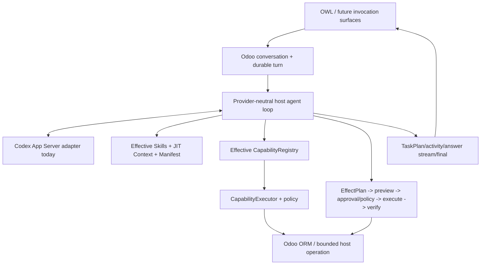

# Odoo AI Assistant documentation

This directory separates current implementation, architectural authority, product direction and validation evidence.

If you only read three documents:

1. [`CURRENT_STATE.md`](CURRENT_STATE.md) — implementation snapshot in human terms.
2. [`ARCHITECTURE.md`](ARCHITECTURE.md) — runtime/authority boundaries.
3. [`PRODUCT_VISION.md`](PRODUCT_VISION.md) — intended product direction.

The exact roadmap/acceptance cursor is always [`research/EXECUTION_STATE.md`](research/EXECUTION_STATE.md).

## Current formal state

```text
P0-P7 COMPLETE / ACCEPTED
  CapabilityProvider live installed-addon composition implemented
  Skills/Bundles live guidance implemented
  ContextProvider JIT projection implemented
  ProviderProfile bound for current Codex seam
  EffectiveAssistantManifest live + diagnostics implemented
  Business/Developer technical profile skeleton implemented
  progressive-disclosure framework accepted; eager default retained from equal-quality evidence
P8 ELIGIBLE / READY TO START (no P8 implementation claimed)
P9+ NOT ELIGIBLE
```

Phase 7 passed Product Behavior FULL x3, all six real gates and the final periodic regression at `092ac57`.

Use:

- [`research/P7_MINI_FRAMEWORK_IMPLEMENTATION.md`](research/P7_MINI_FRAMEWORK_IMPLEMENTATION.md) for what Phase 7 now implements;
- [`research/P7_CONSOLIDATED_VALIDATION_RUNBOOK.md`](research/P7_CONSOLIDATED_VALIDATION_RUNBOOK.md) for the completed acceptance contract;
- [`research/P8_EVIDENCE_CORE_PREPARATION.md`](research/P8_EVIDENCE_CORE_PREPARATION.md) for the prepared Phase-8 start;
- [`research/REAL_ENV_VALIDATION_PROTOCOL.md`](research/REAL_ENV_VALIDATION_PROTOCOL.md) for named real-product gates;
- [`research/PRODUCT_BEHAVIOR_EVALS_V1.md`](research/PRODUCT_BEHAVIOR_EVALS_V1.md) for the permanent product-behavior baseline.

## Choose your path

| I want to... | Start here | Then read |
|---|---|---|
| Know what works/what is accepted | [`CURRENT_STATE.md`](CURRENT_STATE.md) | [`research/EXECUTION_STATE.md`](research/EXECUTION_STATE.md) |
| Understand runtime authority | [`ARCHITECTURE.md`](ARCHITECTURE.md) | [`UNIFIED_AGENT_RUNTIME.md`](UNIFIED_AGENT_RUNTIME.md) |
| Extend capabilities/Skills/context | [`CAPABILITY_FRAMEWORK.md`](CAPABILITY_FRAMEWORK.md) | [`research/P7_MINI_FRAMEWORK_IMPLEMENTATION.md`](research/P7_MINI_FRAMEWORK_IMPLEMENTATION.md) |
| Start Phase 8 | [`research/P8_EVIDENCE_CORE_PREPARATION.md`](research/P8_EVIDENCE_CORE_PREPARATION.md) | [`research/REAL_ENV_VALIDATION_PROTOCOL.md`](research/REAL_ENV_VALIDATION_PROTOCOL.md) |
| Work on Product Behavior evals | [`research/PRODUCT_BEHAVIOR_EVALS_V1.md`](research/PRODUCT_BEHAVIOR_EVALS_V1.md) | [`research/PRODUCT_BEHAVIOR_EVALS_CODEX_HANDOFF.md`](research/PRODUCT_BEHAVIOR_EVALS_CODEX_HANDOFF.md) |
| Add/change a capability | [`CAPABILITY_FRAMEWORK.md`](CAPABILITY_FRAMEWORK.md) | [`../addons/odoo_ai_assistant/runtime/capabilities/README.md`](../addons/odoo_ai_assistant/runtime/capabilities/README.md) |
| Work on provider/agent loop | [`UNIFIED_AGENT_RUNTIME.md`](UNIFIED_AGENT_RUNTIME.md) | [`adr/ADR-019-host-owned-iterative-decision-loop.md`](adr/ADR-019-host-owned-iterative-decision-loop.md) |
| Work on writes/effects | [`ARCHITECTURE.md`](ARCHITECTURE.md) | [`research/P6_PLANNING_EFFECTPLAN_IMPLEMENTATION.md`](research/P6_PLANNING_EFFECTPLAN_IMPLEMENTATION.md) |
| Configure/deploy Codex + Odoo | [`DEPLOYMENT_CONFIG.md`](DEPLOYMENT_CONFIG.md) | [`codex/README.md`](codex/README.md) |
| Validate in real Odoo/provider/browser | [`research/REAL_ENV_VALIDATION_PROTOCOL.md`](research/REAL_ENV_VALIDATION_PROTOCOL.md) | current phase runbook |
| Understand a major architectural decision | [`adr/README.md`](adr/README.md) | relevant accepted ADR |

## Architecture at a glance



`CapabilityDefinition` remains executable authority. Phase-7 `CapabilityProvider`, `SkillDefinition`,
`ContextProvider`, `ProviderProfile` and `EffectiveAssistantManifest` enrich discovery/reasoning but do not bypass the
registry/executor/policy boundary.

## Current vs target notation

- **Current / implemented:** code exists on the supported path.
- **Implemented / validation pending:** code exists but acceptance gate is open.
- **Accepted:** required validation/evidence is green for that lineage.
- **Target:** intended product direction not yet implemented.
- **Historical:** retained only for lineage/evidence.

## Core documentation

### Product/current state

- [`CURRENT_STATE.md`](CURRENT_STATE.md)
- [`PRODUCT_VISION.md`](PRODUCT_VISION.md)
- [`CHAT_PRODUCT_FLOW.md`](CHAT_PRODUCT_FLOW.md)

### Architecture/contracts

- [`ARCHITECTURE.md`](ARCHITECTURE.md)
- [`UNIFIED_AGENT_RUNTIME.md`](UNIFIED_AGENT_RUNTIME.md)
- [`CAPABILITY_FRAMEWORK.md`](CAPABILITY_FRAMEWORK.md)
- [`QUERY_CONTRACT.md`](QUERY_CONTRACT.md)

### Phase/evals/evidence

- [`research/EXECUTION_STATE.md`](research/EXECUTION_STATE.md)
- [`research/AGENTIC_PRODUCT_EVOLUTION_PLAYBOOK.md`](research/AGENTIC_PRODUCT_EVOLUTION_PLAYBOOK.md)
- [`research/P7_MINI_FRAMEWORK_IMPLEMENTATION.md`](research/P7_MINI_FRAMEWORK_IMPLEMENTATION.md)
- [`research/P7_CONSOLIDATED_VALIDATION_RUNBOOK.md`](research/P7_CONSOLIDATED_VALIDATION_RUNBOOK.md)
- [`research/PRODUCT_BEHAVIOR_EVALS_V1.md`](research/PRODUCT_BEHAVIOR_EVALS_V1.md)
- [`research/PERIODIC_FULL_REGRESSION_RUNBOOK.md`](research/PERIODIC_FULL_REGRESSION_RUNBOOK.md)

## Authority when docs disagree

Normally prefer:

1. current code + accepted ADRs;
2. current architecture/subsystem docs;
3. current tests and accepted real evidence;
4. active execution state;
5. older research/reports/external references.

External projects are design references, not authority replacements.

## Documentation maintenance rule

When a subsystem changes, update the nearest current contract and the execution cursor. Never rewrite old evidence to
make it look current and never label an unexecuted gate PASS.
