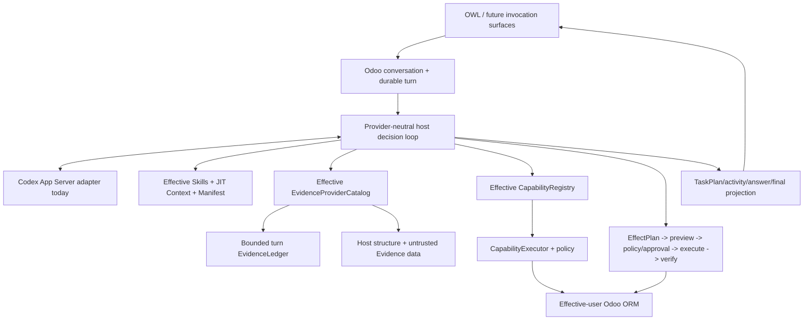

# Odoo AI Assistant documentation

This directory separates current implementation, architectural authority, product
direction and validation evidence.

## Current formal state

```text
P0-P8 COMPLETE / ACCEPTED
P8 focused dependency-light + Odoo validation PASS
P8 real Evidence gates PASS (6/6)
P9 focused validation PASS; real validation BLOCKED on primary Codex reauthentication
P10 NOT YET ELIGIBLE
```

P8 is accepted through `e370af8acb7df175c0a90c8e17520c8576b4c6ce`.
The current P9 validation checkpoint is
[`research/evidence/phase9/2026-09-03/P9-VALIDATION-BLOCKED-e227da1.md`](research/evidence/phase9/2026-09-03/P9-VALIDATION-BLOCKED-e227da1.md).
No new PASS evidence is inferred without executed evidence.

## Primary reading path

1. [`CURRENT_STATE.md`](CURRENT_STATE.md) — implementation snapshot in human terms.
2. [`ARCHITECTURE.md`](ARCHITECTURE.md) — runtime and authority boundaries.
3. [`PRODUCT_VISION.md`](PRODUCT_VISION.md) — product direction and confirmed product decisions.
4. [`CAPABILITY_FRAMEWORK.md`](CAPABILITY_FRAMEWORK.md) — executable/provider/Skill/Context/Evidence extension contract.
5. [`EVIDENCE_ARCHITECTURE.md`](EVIDENCE_ARCHITECTURE.md) — P8 retrieval/Evidence contract.
6. [`OBSERVABILITY_ARCHITECTURE.md`](OBSERVABILITY_ARCHITECTURE.md) — trace/privacy contract.
7. [`research/EXECUTION_STATE.md`](research/EXECUTION_STATE.md) — exact roadmap cursor.

## Architecture at a glance



`CapabilityDefinition` remains executable authority. `CapabilityProvider`, Skills,
ContextProviders, EvidenceProviders, manifests and ledgers enrich discovery/reasoning
but cannot bypass registry/executor/policy. Relevant live decisions now use bounded
question-sensitive Evidence search/fetch through the same provider-neutral decision
wrapper; generic turns may retrieve nothing.

## Current subsystem documents

### Product and runtime

- [`CURRENT_STATE.md`](CURRENT_STATE.md)
- [`PRODUCT_VISION.md`](PRODUCT_VISION.md)
- [`CHAT_PRODUCT_FLOW.md`](CHAT_PRODUCT_FLOW.md)
- [`ARCHITECTURE.md`](ARCHITECTURE.md)
- [`UNIFIED_AGENT_RUNTIME.md`](UNIFIED_AGENT_RUNTIME.md)
- [`TURN_LIFECYCLE_COMPOSITION.md`](TURN_LIFECYCLE_COMPOSITION.md)

### Capabilities, Context and Evidence

- [`CAPABILITY_FRAMEWORK.md`](CAPABILITY_FRAMEWORK.md)
- [`EVIDENCE_ARCHITECTURE.md`](EVIDENCE_ARCHITECTURE.md)
- [`KNOWLEDGE_INDEX.md`](KNOWLEDGE_INDEX.md)
- [`CONTEXT_SOURCE_POLICY.md`](CONTEXT_SOURCE_POLICY.md)
- [`QUERY_CONTRACT.md`](QUERY_CONTRACT.md)
- [`adr/ADR-022-evidence-core-and-ledger.md`](adr/ADR-022-evidence-core-and-ledger.md)

### Observability and future Technical boundary

- [`OBSERVABILITY_ARCHITECTURE.md`](OBSERVABILITY_ARCHITECTURE.md)
- [`adr/ADR-023-host-owned-observability.md`](adr/ADR-023-host-owned-observability.md)
- [`adr/ADR-024-technical-host-privilege-broker.md`](adr/ADR-024-technical-host-privilege-broker.md)
  — proposed only; no privileged broker is implemented.

### Execution, evals and evidence

- [`research/EXECUTION_STATE.md`](research/EXECUTION_STATE.md)
- [`research/P8_EVIDENCE_CORE_IMPLEMENTATION.md`](research/P8_EVIDENCE_CORE_IMPLEMENTATION.md)
- [`research/P8_FOCUSED_VALIDATION_RUNBOOK.md`](research/P8_FOCUSED_VALIDATION_RUNBOOK.md)
- [`research/P8_EVIDENCE_CORE_PREPARATION.md`](research/P8_EVIDENCE_CORE_PREPARATION.md)
  — completed historical preparation contract.
- [`research/REAL_ENV_VALIDATION_PROTOCOL.md`](research/REAL_ENV_VALIDATION_PROTOCOL.md)
- [`research/PRODUCT_BEHAVIOR_EVALS_V1.md`](research/PRODUCT_BEHAVIOR_EVALS_V1.md)
- [`research/PERIODIC_FULL_REGRESSION_RUNBOOK.md`](research/PERIODIC_FULL_REGRESSION_RUNBOOK.md)

## Supported-path cleanup

The embedded Odoo addon is the product runtime. The obsolete GitHub Actions workflow,
the unauthenticated sidecar inventory callback, its addon-local machine-auth primitive
and the residual addon inventory service are removed from the supported tree.
Installation inventory is owned directly by the in-process
`assistant.runtime_inventory` Evidence provider.

Historical `service/`, `installer/`, migration/task/evidence records may remain for
lineage, but are excluded from current source context by
[`CONTEXT_SOURCE_POLICY.md`](CONTEXT_SOURCE_POLICY.md).

## Current versus target notation

- **Implemented:** code exists on the supported path.
- **Implemented / validation pending:** code exists but its required gate is open.
- **Accepted:** required validation/evidence is green for that lineage.
- **Target/proposed:** product direction or ADR not yet implemented.
- **Historical:** retained only for lineage/evidence.

## Authority when documents disagree

Prefer:

1. current code and accepted ADRs;
2. current architecture/subsystem documents;
3. current tests and accepted real evidence;
4. active execution state;
5. dated research, reports and external references.

External projects and Project PDFs provide patterns, not execution authority.

## Documentation maintenance

When a subsystem changes, update the nearest current contract and execution cursor in
the same checkpoint. Do not rewrite historical evidence to look current and never
label an unexecuted gate PASS.
