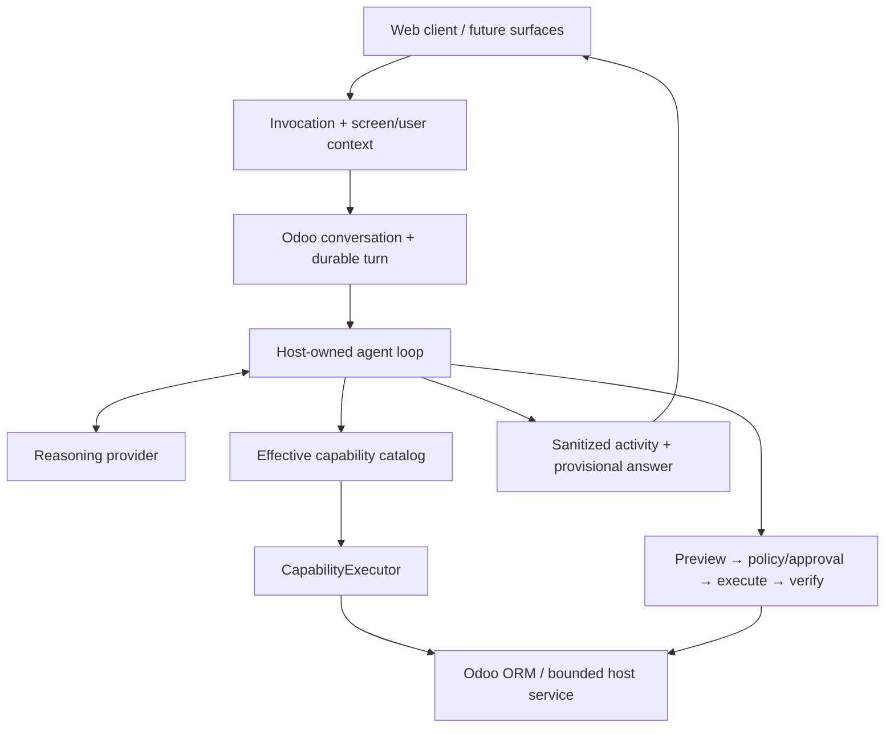

# Odoo AI Assistant documentation

This directory is the navigation layer for the project. It separates **what exists now**, **why the architecture looks this way**, **what the product is becoming**, and **how roadmap work is validated**.

If you only read three documents, read:

1. [`CURRENT_STATE.md`](CURRENT_STATE.md) — implementation truth in human terms.
2. [`ARCHITECTURE.md`](ARCHITECTURE.md) — current boundaries and invariants.
3. [`PRODUCT_VISION.md`](PRODUCT_VISION.md) — intended product direction.

## Choose your path

| I want to... | Start here | Then read |
|---|---|---|
| Understand the project from outside development | [`../README.md`](../README.md) | [`PRODUCT_VISION.md`](PRODUCT_VISION.md), component READMEs |
| Know what actually works today | [`CURRENT_STATE.md`](CURRENT_STATE.md) | [`research/EXECUTION_STATE.md`](research/EXECUTION_STATE.md) |
| Understand the runtime | [`ARCHITECTURE.md`](ARCHITECTURE.md) | [`UNIFIED_AGENT_RUNTIME.md`](UNIFIED_AGENT_RUNTIME.md) |
| Add or change a capability | [`CAPABILITY_FRAMEWORK.md`](CAPABILITY_FRAMEWORK.md) | [`../addons/odoo_ai_assistant/runtime/capabilities/README.md`](../addons/odoo_ai_assistant/runtime/capabilities/README.md) |
| Work on the agent/provider loop | [`UNIFIED_AGENT_RUNTIME.md`](UNIFIED_AGENT_RUNTIME.md) | [`adr/ADR-019-host-owned-iterative-decision-loop.md`](adr/ADR-019-host-owned-iterative-decision-loop.md) |
| Work on writes/actions | [`ARCHITECTURE.md`](ARCHITECTURE.md) | [`adr/ADR-014-unified-host-authorized-agent.md`](adr/ADR-014-unified-host-authorized-agent.md) |
| Configure/deploy Odoo + Codex | [`DEPLOYMENT_CONFIG.md`](DEPLOYMENT_CONFIG.md) | [`codex/README.md`](codex/README.md) |
| Understand query behavior | [`QUERY_CONTRACT.md`](QUERY_CONTRACT.md) | capability provider README |
| Follow current roadmap execution | [`research/EXECUTION_STATE.md`](research/EXECUTION_STATE.md) | active playbook/slice referenced there |
| Validate in a real environment | [`research/REAL_ENV_VALIDATION_PROTOCOL.md`](research/REAL_ENV_VALIDATION_PROTOCOL.md) | relevant evidence folder |
| Understand why a major decision was made | [`adr/README.md`](adr/README.md) | the accepted ADR |
| Explore historical design | [`HISTORICAL_DOCUMENTATION.md`](HISTORICAL_DOCUMENTATION.md) | archive/source-of-truth material |

## Current architecture at a glance



Today this is an embedded Odoo runtime using Codex as the product reasoning provider. General RAG, first-class Skills/Bundles, external `CapabilityProvider`, MCP, automations/AI fields and governed memory are later layers, not current claims.

## Current vs target notation

Documentation should make lifecycle status obvious:

- **Current / implemented:** code exists in the supported runtime.
- **Implemented, validation pending:** code is in `main` but a required acceptance gate is still open.
- **Target / roadmap:** accepted product direction but not an implementation claim.
- **Historical / retired:** kept for lineage/evidence only.

This is especially important while Phase 5 is active. At the time of this README update, P0-P4,
P5.1 and P5.2 are accepted; P5.3 stable settings snapshot is READY. The exact live cursor is always
[`research/EXECUTION_STATE.md`](research/EXECUTION_STATE.md).

## Documentation layers

### Product and current state

- [`PRODUCT_VISION.md`](PRODUCT_VISION.md) — the intended user experience and product boundaries.
- [`CURRENT_STATE.md`](CURRENT_STATE.md) — what is currently implemented, accepted or still missing.
- [`CHAT_PRODUCT_FLOW.md`](CHAT_PRODUCT_FLOW.md) — chat-facing flow and interaction contracts where applicable.

### Architecture and subsystem contracts

- [`ARCHITECTURE.md`](ARCHITECTURE.md) — current system architecture.
- [`UNIFIED_AGENT_RUNTIME.md`](UNIFIED_AGENT_RUNTIME.md) — agent runtime details.
- [`CAPABILITY_FRAMEWORK.md`](CAPABILITY_FRAMEWORK.md) — atomic capabilities, registry, executor and target extension model.
- [`QUERY_CONTRACT.md`](QUERY_CONTRACT.md) — bounded query semantics.
- [`KNOWLEDGE_INDEX.md`](KNOWLEDGE_INDEX.md) — knowledge/index direction; check `CURRENT_STATE.md` before treating it as active runtime.
- [`FUTURE_MODEL_ROUTING.md`](FUTURE_MODEL_ROUTING.md) — future provider/model routing ideas, not current product behavior.

### Operations and provider lifecycle

- [`DEPLOYMENT_CONFIG.md`](DEPLOYMENT_CONFIG.md)
- [`codex/README.md`](codex/README.md)
- [`codex/CODEX_AUTH.md`](codex/CODEX_AUTH.md)
- [`DEPLOYMENT_CONFIG.md`](DEPLOYMENT_CONFIG.md) is the current deployment/configuration entry point; sidecar-era operations documents are historical.

### Architecture decisions

[`adr/`](adr/) contains accepted decisions. The most important current foundation is:

```text
ADR-016  Embedded Odoo runtime / one operational application
ADR-017  CapabilityDefinition as the atomic capability contract
ADR-018  Database-scoped Codex activation
ADR-019  Host-owned iterative decision loop
```

An ADR explains a decision and its trade-offs; it does not replace the current code if implementation later evolves under a newer accepted ADR.

### Research, roadmap and evidence

[`research/`](research/) contains execution playbooks, phase/slice records and named acceptance evidence. These files are intentionally more procedural than the user-facing architecture docs.

Always use [`research/EXECUTION_STATE.md`](research/EXECUTION_STATE.md) as the active roadmap cursor rather than assuming a phase from an older playbook.

## Component READMEs

The addon is documented locally so a contributor can understand one area without reverse-engineering the whole repository.

```text
addons/odoo_ai_assistant/
├── README.md                    addon overview / lifecycle
├── controllers/README.md        HTTP/RPC boundary
├── models/README.md             durable Odoo state
├── services/README.md           small application services
├── runtime/README.md            embedded AI runtime
│   ├── agent/README.md          host-owned reasoning loop
│   └── capabilities/README.md   capability host
│       ├── adapters/README.md   provider/transport projections
│       └── providers/README.md  current executable capabilities
├── static/src/README.md         frontend architecture
│   ├── components/README.md
│   └── services/README.md
├── security/README.md
├── data/README.md
├── migrations/README.md
├── views/README.md
├── tests/README.md
└── static/tests/README.md
```

## Source of truth

When two sources disagree, normally prefer:

1. current code and accepted ADRs;
2. `CURRENT_STATE.md`, `ARCHITECTURE.md` and subsystem contracts;
3. current tests and named real-environment evidence;
4. active research/playbooks;
5. dated reports and Project reference documents;
6. retired code/historical documentation.

External projects and research are design references, not requirements.

## How to keep the docs useful

When changing a subsystem:

- update the **nearest component README** if its responsibility, entry point or extension method changed;
- update `CURRENT_STATE.md` when the project can or cannot do something materially different;
- update `ARCHITECTURE.md` when a cross-component boundary changes;
- add/update an ADR when authority, deployment, persistence or a major architecture invariant changes;
- update `research/EXECUTION_STATE.md` only as part of the governed roadmap/validation process;
- do not rewrite history to make an old report look current;
- mark target behavior as target until the relevant tests/real gates are accepted.

The aim is for a new reader to answer four questions quickly: **what is this piece for, how does it connect, how do I extend/replace it, and what must never be bypassed?**
