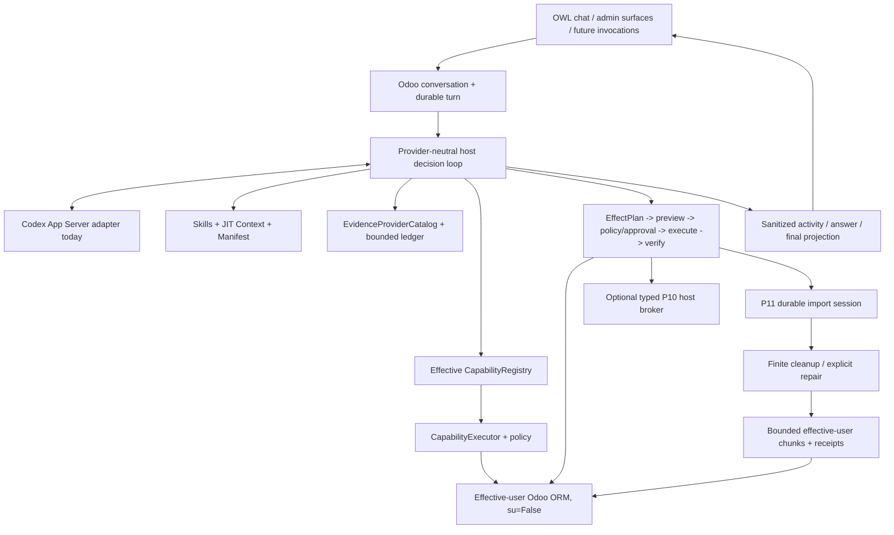

# Odoo AI Assistant documentation

This directory separates current implementation, architectural authority, product
direction and validation evidence.

## Current formal state

```text
P0-P10 COMPLETE / ACCEPTED
P11 ADVANCED IMPORTS CSV CORE IMPLEMENTED
P11 CLEANUP + REJECTED-WINDOW REPAIR IMPLEMENTED
P11 FOCUSED + REAL VALIDATION PENDING
P11 NOT ACCEPTED
```

P10 remains the latest accepted phase through
`bde508b737c132140e237cdfde31aee9b37eca5f`; its evidence is
[`research/evidence/phase10/2026-09-03/P10-ACCEPTANCE-bde508b.md`](research/evidence/phase10/2026-09-03/P10-ACCEPTANCE-bde508b.md).

P11 now has executable durable CSV staging/chunks, deterministic cleanup, rejected-row
inspection and explicit repair/resume. No P11 gate is represented as PASS yet. The
exact cursor is [`research/EXECUTION_STATE.md`](research/EXECUTION_STATE.md).

## Primary reading path

1. [`CURRENT_STATE.md`](CURRENT_STATE.md) — current supported product snapshot.
2. [`ARCHITECTURE.md`](ARCHITECTURE.md) — runtime and authority boundaries.
3. [`PRODUCT_VISION.md`](PRODUCT_VISION.md) — product direction.
4. [`CAPABILITY_FRAMEWORK.md`](CAPABILITY_FRAMEWORK.md) — executable/provider/Skill/Context/Evidence contract.
5. [`EVIDENCE_ARCHITECTURE.md`](EVIDENCE_ARCHITECTURE.md) — retrieval/Evidence contract.
6. [`KNOWLEDGE_INDEX.md`](KNOWLEDGE_INDEX.md) — P9 Knowledge lifecycle.
7. [`adr/ADR-024-technical-host-privilege-broker.md`](adr/ADR-024-technical-host-privilege-broker.md) — accepted P10 host boundary.
8. [`research/P11_ADVANCED_IMPORTS_FIRST_SLICE.md`](research/P11_ADVANCED_IMPORTS_FIRST_SLICE.md) — durable CSV staging/chunk contract.
9. [`research/P11_IMPORT_CLEANUP_REPAIR_SLICE.md`](research/P11_IMPORT_CLEANUP_REPAIR_SLICE.md) — deterministic cleanup + repair/resume contract.
10. [`research/P11_FOCUSED_VALIDATION_RUNBOOK.md`](research/P11_FOCUSED_VALIDATION_RUNBOOK.md) — immediate focused and real P11 gates.
11. [`research/EXECUTION_STATE.md`](research/EXECUTION_STATE.md) — exact roadmap cursor.

## Architecture at a glance



`CapabilityDefinition` remains executable authority. Skills, ContextProviders,
EvidenceProviders, manifests, file contents and cleanup proposals cannot bypass the
registry, executor, Odoo ACLs or policy.

P11 imports do not use the P10 broker. Their business writes remain inside Odoo under
the originating user and `su=False`.

## Current subsystem documents

### Product and runtime

- [`CURRENT_STATE.md`](CURRENT_STATE.md)
- [`PRODUCT_VISION.md`](PRODUCT_VISION.md)
- [`CHAT_PRODUCT_FLOW.md`](CHAT_PRODUCT_FLOW.md)
- [`ARCHITECTURE.md`](ARCHITECTURE.md)
- [`UNIFIED_AGENT_RUNTIME.md`](UNIFIED_AGENT_RUNTIME.md)
- [`TURN_LIFECYCLE_COMPOSITION.md`](TURN_LIFECYCLE_COMPOSITION.md)

### Capabilities, Context, Evidence, Knowledge and artifacts

- [`CAPABILITY_FRAMEWORK.md`](CAPABILITY_FRAMEWORK.md)
- [`EVIDENCE_ARCHITECTURE.md`](EVIDENCE_ARCHITECTURE.md)
- [`KNOWLEDGE_INDEX.md`](KNOWLEDGE_INDEX.md)
- [`CONTEXT_SOURCE_POLICY.md`](CONTEXT_SOURCE_POLICY.md)
- [`QUERY_CONTRACT.md`](QUERY_CONTRACT.md)
- [`adr/ADR-022-evidence-core-and-ledger.md`](adr/ADR-022-evidence-core-and-ledger.md)
- [`research/P11_ADVANCED_IMPORTS_FIRST_SLICE.md`](research/P11_ADVANCED_IMPORTS_FIRST_SLICE.md)
- [`research/P11_IMPORT_CLEANUP_REPAIR_SLICE.md`](research/P11_IMPORT_CLEANUP_REPAIR_SLICE.md)

### Observability and Technical boundary

- [`OBSERVABILITY_ARCHITECTURE.md`](OBSERVABILITY_ARCHITECTURE.md)
- [`adr/ADR-023-host-owned-observability.md`](adr/ADR-023-host-owned-observability.md)
- [`adr/ADR-024-technical-host-privilege-broker.md`](adr/ADR-024-technical-host-privilege-broker.md)
- [`../host_broker/README.md`](../host_broker/README.md)

### Execution, evals and evidence

- [`research/EXECUTION_STATE.md`](research/EXECUTION_STATE.md)
- [`research/P11_FOCUSED_VALIDATION_RUNBOOK.md`](research/P11_FOCUSED_VALIDATION_RUNBOOK.md)
- [`research/REAL_ENV_VALIDATION_PROTOCOL.md`](research/REAL_ENV_VALIDATION_PROTOCOL.md)
- [`research/PRODUCT_BEHAVIOR_EVALS_V1.md`](research/PRODUCT_BEHAVIOR_EVALS_V1.md)
- [`research/PERIODIC_FULL_REGRESSION_RUNBOOK.md`](research/PERIODIC_FULL_REGRESSION_RUNBOOK.md)

## Supported runtime boundary

The embedded Odoo addon is the product runtime. Historical `service/`, `installer/`,
root migration/task/evidence artifacts may remain for lineage but are excluded from
current source context by [`CONTEXT_SOURCE_POLICY.md`](CONTEXT_SOURCE_POLICY.md).
`host_broker/` is the finite accepted P10 machine adapter, not a restored Assistant
sidecar.

## Status notation

- **Implemented / validation pending:** code exists but required gates remain open.
- **Accepted:** required validation/evidence is green for that lineage.
- **Target/proposed:** product direction not yet implemented.
- **Historical:** retained for lineage/evidence only.

When documents disagree, prefer current code + accepted ADRs, then current subsystem
docs/tests/evidence, then dated research. Never label an unexecuted gate PASS.
